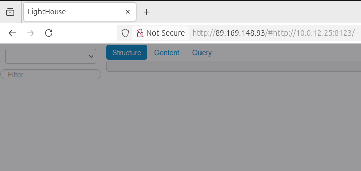

# Домашнее задание к занятию 4 «Работа с roles»

## Подготовка к выполнению

1. * Необязательно. Познакомьтесь с [LightHouse](https://youtu.be/ymlrNlaHzIY?t=929).
2. Создайте два пустых публичных репозитория в любом своём проекте: vector-role и lighthouse-role.
3. Добавьте публичную часть своего ключа к своему профилю на GitHub.

## Основная часть

Ваша цель — разбить ваш playbook на отдельные roles. 

Задача — сделать roles для ClickHouse, Vector и LightHouse и написать playbook для использования этих ролей. 

Ожидаемый результат — существуют три ваших репозитория: два с roles и один с playbook.

**Что нужно сделать**

1. Создайте в старой версии playbook файл `requirements.yml` и заполните его содержимым:

   ```yaml
   ---
     - src: git@github.com:AlexeySetevoi/ansible-clickhouse.git
       scm: git
       version: "1.13"
       name: clickhouse 
   ```

2. При помощи `ansible-galaxy` скачайте себе эту роль.
3. Создайте новый каталог с ролью при помощи `ansible-galaxy role init vector-role`.
4. На основе tasks из старого playbook заполните новую role. Разнесите переменные между `vars` и `default`. 
5. Перенести нужные шаблоны конфигов в `templates`.
6. Опишите в `README.md` обе роли и их параметры. Пример качественной документации ansible role [по ссылке](https://github.com/cloudalchemy/ansible-prometheus).
7. Повторите шаги 3–6 для LightHouse. Помните, что одна роль должна настраивать один продукт.
8. Выложите все roles в репозитории. Проставьте теги, используя семантическую нумерацию. Добавьте roles в `requirements.yml` в playbook.
9. Переработайте playbook на использование roles. Не забудьте про зависимости LightHouse и возможности совмещения `roles` с `tasks`.
10. Выложите playbook в репозиторий.
11. В ответе дайте ссылки на оба репозитория с roles и одну ссылку на репозиторий с playbook.

---

### roles:

[Ansible Role Lighthouse](https://github.com/slagovskiy/netology_role_lighthouse)

[Asible Role Vector](https://github.com/slagovskiy/netology_role_vector)


### requirements

```
$ cat requirements.yml

---
  - src: git@github.com:AlexeySetevoi/ansible-clickhouse.git
    scm: git
    version: "1.13"
    name: clickhouse 

  - src: git@github.com:slagovskiy/netology_role_lighthouse.git
    scm: git
    version: "v0.1"
    name: lighthouse

  - src: git@github.com:slagovskiy/netology_role_vector.git
    scm: git
    version: "v0.1"
    name: vector
```


### init

```
terraform apply

...
...
...
module.vpc_prod.yandex_vpc_network.vpc: Creating...
module.vpc_prod.yandex_vpc_network.vpc: Creation complete after 2s [id=enpvad8hde11v360b45l]
module.vpc_prod.yandex_vpc_subnet.subnet["ru-central1-a"]: Creating...
module.vpc_prod.yandex_vpc_subnet.subnet["ru-central1-a"]: Creation complete after 3s [id=e9bufv4v3l98dfnp8ejp]
module.vectors.yandex_compute_instance.vm[0]: Creating...
module.clickhouse.yandex_compute_instance.vm[0]: Creating...
module.vectors.yandex_compute_instance.vm[1]: Creating...
module.lighthouse.yandex_compute_instance.vm[0]: Creating...
module.vectors.yandex_compute_instance.vm[0]: Still creating... [10s elapsed]
module.clickhouse.yandex_compute_instance.vm[0]: Still creating... [10s elapsed]
module.vectors.yandex_compute_instance.vm[1]: Still creating... [10s elapsed]
module.lighthouse.yandex_compute_instance.vm[0]: Still creating... [10s elapsed]
module.vectors.yandex_compute_instance.vm[0]: Still creating... [20s elapsed]
module.clickhouse.yandex_compute_instance.vm[0]: Still creating... [20s elapsed]
module.vectors.yandex_compute_instance.vm[1]: Still creating... [20s elapsed]
module.lighthouse.yandex_compute_instance.vm[0]: Still creating... [20s elapsed]
module.vectors.yandex_compute_instance.vm[0]: Still creating... [30s elapsed]
module.clickhouse.yandex_compute_instance.vm[0]: Still creating... [30s elapsed]
module.vectors.yandex_compute_instance.vm[1]: Still creating... [30s elapsed]
module.lighthouse.yandex_compute_instance.vm[0]: Still creating... [30s elapsed]
module.vectors.yandex_compute_instance.vm[0]: Still creating... [40s elapsed]
module.lighthouse.yandex_compute_instance.vm[0]: Still creating... [40s elapsed]
module.clickhouse.yandex_compute_instance.vm[0]: Still creating... [40s elapsed]
module.vectors.yandex_compute_instance.vm[1]: Still creating... [40s elapsed]
module.vectors.yandex_compute_instance.vm[0]: Still creating... [50s elapsed]
module.clickhouse.yandex_compute_instance.vm[0]: Still creating... [50s elapsed]
module.lighthouse.yandex_compute_instance.vm[0]: Still creating... [50s elapsed]
module.vectors.yandex_compute_instance.vm[1]: Still creating... [50s elapsed]
module.vectors.yandex_compute_instance.vm[0]: Still creating... [1m0s elapsed]
module.vectors.yandex_compute_instance.vm[1]: Still creating... [1m0s elapsed]
module.lighthouse.yandex_compute_instance.vm[0]: Still creating... [1m0s elapsed]
module.clickhouse.yandex_compute_instance.vm[0]: Still creating... [1m0s elapsed]
module.vectors.yandex_compute_instance.vm[0]: Creation complete after 1m6s [id=fhmakebkosg95uq4vo82]
module.vectors.yandex_compute_instance.vm[1]: Creation complete after 1m7s [id=fhm3ht67lu7np71b1o5t]
module.lighthouse.yandex_compute_instance.vm[0]: Creation complete after 1m9s [id=fhme0lcpnsvputksass2]
module.clickhouse.yandex_compute_instance.vm[0]: Still creating... [1m10s elapsed]
module.clickhouse.yandex_compute_instance.vm[0]: Creation complete after 1m10s [id=fhmgvc8ejnbbud0fd8mu]
local_file.inventory: Creating...
local_file.inventory: Creation complete after 0s [id=a3775d13e9b3ca27217461ae805df377e6bc0fc0]

Apply complete! Resources: 7 added, 0 changed, 0 destroyed.
```

### install roles

```
$ ansible-galaxy install -r requirements.yml 
Starting galaxy role install process
- clickhouse (1.13) is already installed, skipping.
- lighthouse (v1.0) is already installed, skipping.
- vector (v1.0) is already installed, skipping.
```

### diff-0

```
$ ansible-playbook -i inventory/prod.yml playbook.yml --diff

...
...
...

PLAY RECAP ********************************************************************************************************************************************************
clickhouse-0.ru-central1.internal : ok=28   changed=11   unreachable=0    failed=0    skipped=9    rescued=0    ignored=0   
lighthouse-0.ru-central1.internal : ok=29   changed=10   unreachable=0    failed=0    skipped=28   rescued=0    ignored=0   
vector-0.ru-central1.internal : ok=9    changed=6    unreachable=0    failed=0    skipped=1    rescued=0    ignored=0   
vector-1.ru-central1.internal : ok=9    changed=6    unreachable=0    failed=0    skipped=1    rescued=0    ignored=0   
```

### diff-1

```
$ ansible-playbook -i inventory/prod.yml playbook.yml --diff

...
...
...

PLAY RECAP ********************************************************************************************************************************************************
clickhouse-0.ru-central1.internal : ok=26   changed=0    unreachable=0    failed=0    skipped=10   rescued=0    ignored=0   
lighthouse-0.ru-central1.internal : ok=26   changed=0    unreachable=0    failed=0    skipped=27   rescued=0    ignored=0   
vector-0.ru-central1.internal : ok=7    changed=0    unreachable=0    failed=0    skipped=1    rescued=0    ignored=0   
vector-1.ru-central1.internal : ok=7    changed=0    unreachable=0    failed=0    skipped=1    rescued=0    ignored=0   
```

### screen



[playbook](playbook/README.md)