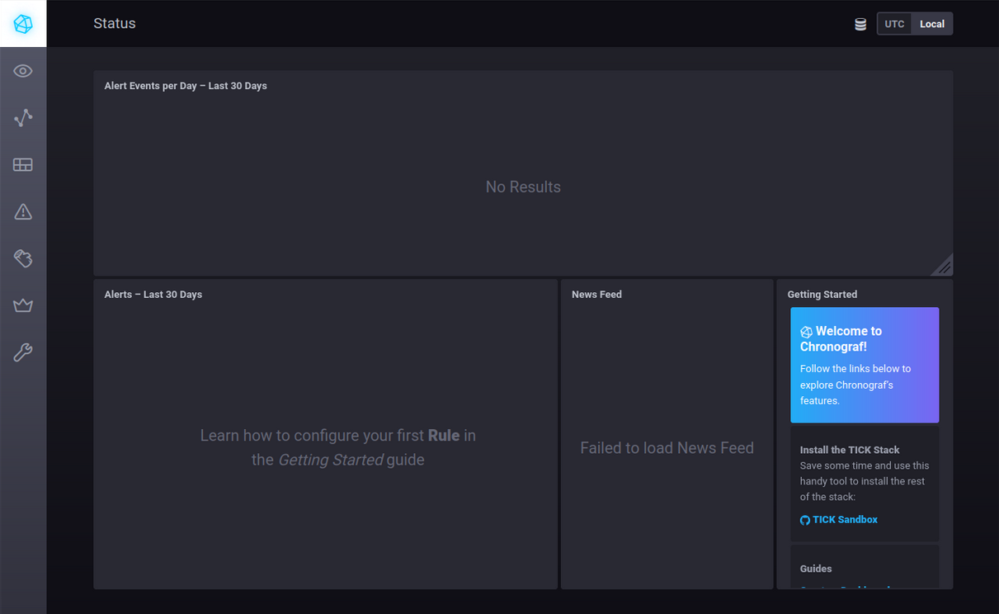
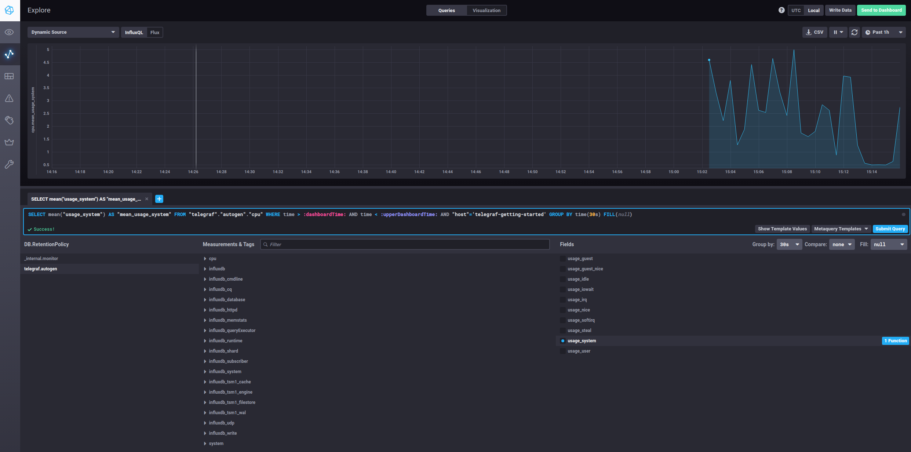
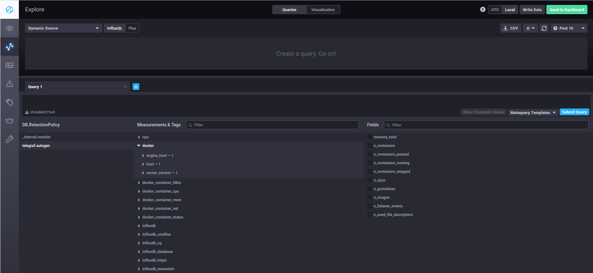

# Домашнее задание к занятию "13.Системы мониторинга"

## Обязательные задания

1. Вас пригласили настроить мониторинг на проект. На онбординге вам рассказали, что проект представляет из себя платформу для вычислений с выдачей текстовых отчетов, которые сохраняются на диск. Взаимодействие с платформой осуществляется по протоколу http. Также вам отметили, что вычисления загружают ЦПУ. Какой минимальный набор метрик вы выведете в мониторинг и почему?

**Ответ:**

*Дисковая система:*
- FS
- IOPS
- inodes

*CPU:*
- CPU LA
- RAM/swap

*Сеть:*
- NetTraffic
- Коды и уровень ошибок http

2. Менеджер продукта посмотрев на ваши метрики сказал, что ему непонятно что такое RAM/inodes/CPUla. Также он сказал, что хочет понимать, насколько мы выполняем свои обязанности перед клиентами и какое качество обслуживания. Что вы можете ему предложить?

**Ответ:**

Объясню менеджеру продукта, что:
- RAM - утилизация оперативной памяти
- inodes - колличество индексных дескрипторов
- load average — показатель средней загруженности системы.

Порекомендую прочитать SLA (соглашениt об уровне обслуживания), посмотреть SLO (цели уровня обслуживания) и (SLI) индикаторы уровня обслуживания.

3. Вашей DevOps команде в этом году не выделили финансирование на построение системы сбора логов. Разработчики в свою очередь хотят видеть все ошибки, которые выдают их приложения. Какое решение вы можете предпринять в этой ситуации, чтобы разработчики получали ошибки приложения?

**Ответ:**

Можно рассмотреть коробочное решение. Например Zabbix или Prometheus.

4. Вы, как опытный SRE, сделали мониторинг, куда вывели отображения выполнения SLA=99% по http кодам ответов. Вычисляете этот параметр по следующей формуле: summ_2xx_requests/summ_all_requests. Данный параметр не поднимается выше 70%, но при этом в вашей системе нет кодов ответа 5xx и 4xx. Где у вас ошибка?

**Ответ:**

Нужно учесть коды переадресации 3хх (http -> https), формула должна выглядеть так: `(summ_2xx_requests+summ_3xx_requests)/summ_all_requests`

5. Опишите основные плюсы и минусы pull и push систем мониторинга.

**Ответ:**

*push*
+ Не требуется наличие централизованного сервера для опроса источников данных
+ Можно регулировать параметры отправки от агента к агенту (например объём данных и частоту отправки)
+ Можно использовать UDP — это менее затратный способ передачи данных (может возрасти производительность сбора метрик)
+ Можно производить мониторинг машин за NAT и Firewall
+ Легко масштабировать, добавлять новые узлы без усложнения конфигурации

- Необходимо устанавливать и настраивать агенты на каждой машине для мониторинга.
- Центральный сервер не контролирует, какие данные и когда отправляются.
- Данные отправляются асинхронно, сложнее гарантировать, что все метрики будут получены в одном временном окне

*pull*
+ Централизованный контроль. Сервер инициирует сбор данных (какие и когда собирать)
+ Нет необходимости устанавливать и поддерживать агенты на хостах.
+ Можно повторно запрашивать данные, если первоначальный запрос не был успешным

- Трудно опрашивать машины за NAT и Firewall
- Если источник данных временно недоступен, то данные будут утеряны.
- Труднее масштабировать

6. Какие из ниже перечисленных систем относятся к push модели, а какие к pull? А может есть гибридные?

    - Prometheus 
    - TICK
    - Zabbix
    - VictoriaMetrics
    - Nagios

**Ответ:**

  - Prometheus - pull (с поддержкой push через Pushgateway)
  - TICK - push
  - Zabbix - гибрид
  - VictoriaMetrics - pull
  - Nagios - гибрид


7. Склонируйте себе [репозиторий](https://github.com/influxdata/sandbox/tree/master) и запустите TICK-стэк, 
используя технологии docker и docker-compose.

В виде решения на это упражнение приведите скриншот веб-интерфейса ПО chronograf (`http://localhost:8888`). 

P.S.: если при запуске некоторые контейнеры будут падать с ошибкой - проставьте им режим `Z`, например
`./data:/var/lib:Z`
#

**Ответ:**



8. Перейдите в веб-интерфейс Chronograf (http://localhost:8888) и откройте вкладку Data explorer.
        
    - Нажмите на кнопку Add a query
    - Изучите вывод интерфейса и выберите БД telegraf.autogen
    - В `measurments` выберите cpu->host->telegraf-getting-started, а в `fields` выберите usage_system. Внизу появится график утилизации cpu.
    - Вверху вы можете увидеть запрос, аналогичный SQL-синтаксису. Поэкспериментируйте с запросом, попробуйте изменить группировку и интервал наблюдений.

Для выполнения задания приведите скриншот с отображением метрик утилизации cpu из веб-интерфейса.
#

**Ответ:**



9. Изучите список [telegraf inputs](https://github.com/influxdata/telegraf/tree/master/plugins/inputs). 
Добавьте в конфигурацию telegraf следующий плагин - [docker](https://github.com/influxdata/telegraf/tree/master/plugins/inputs/docker):
```
[[inputs.docker]]
  endpoint = "unix:///var/run/docker.sock"
```

Дополнительно вам может потребоваться донастройка контейнера telegraf в `docker-compose.yml` дополнительного volume и 
режима privileged:
```
  telegraf:
    image: telegraf:1.4.0
    privileged: true
    volumes:
      - ./etc/telegraf.conf:/etc/telegraf/telegraf.conf:Z
      - /var/run/docker.sock:/var/run/docker.sock:Z
    links:
      - influxdb
    ports:
      - "8092:8092/udp"
      - "8094:8094"
      - "8125:8125/udp"
```

После настройке перезапустите telegraf, обновите веб интерфейс и приведите скриншотом список `measurments` в 
веб-интерфейсе базы telegraf.autogen . Там должны появиться метрики, связанные с docker.

Факультативно можете изучить какие метрики собирает telegraf после выполнения данного задания.

**Ответ:**



---
