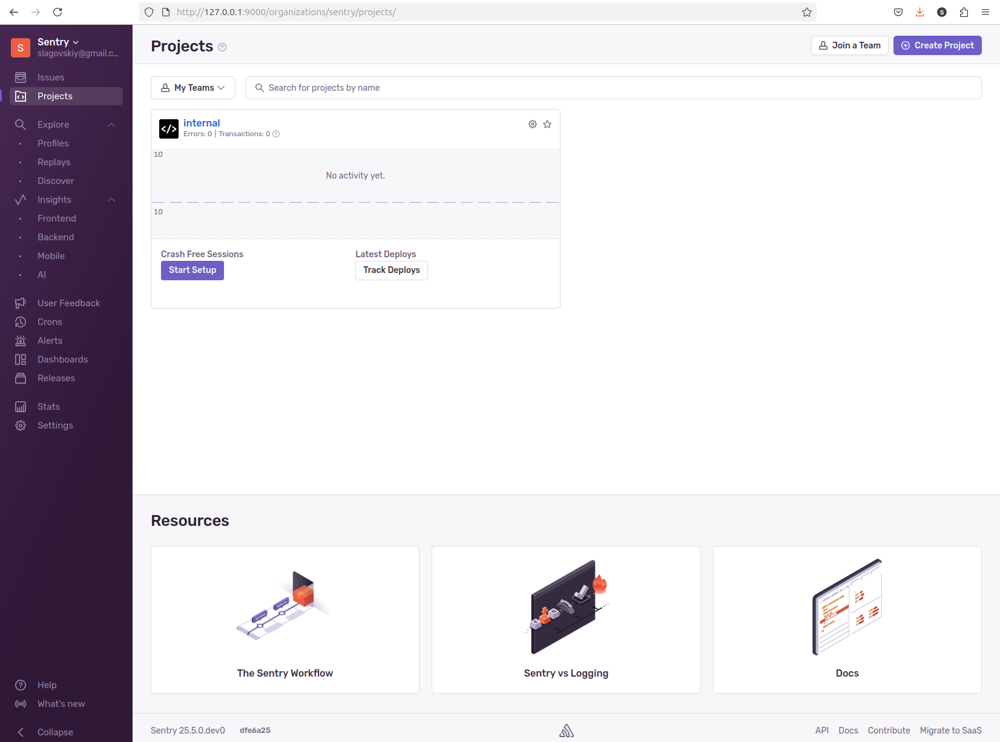
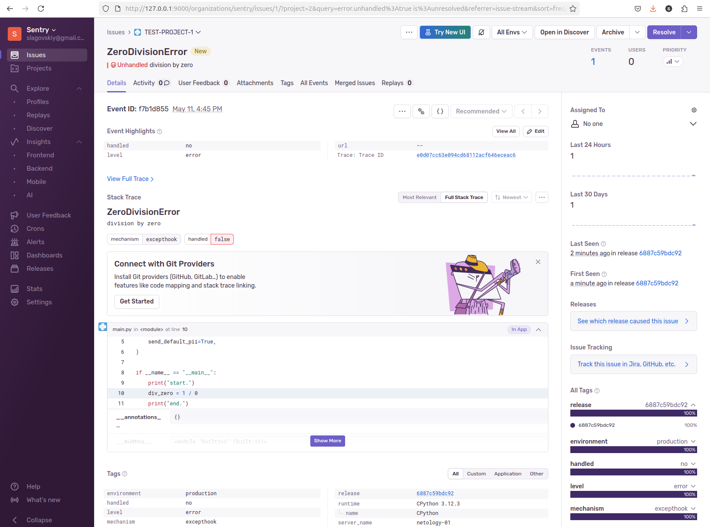
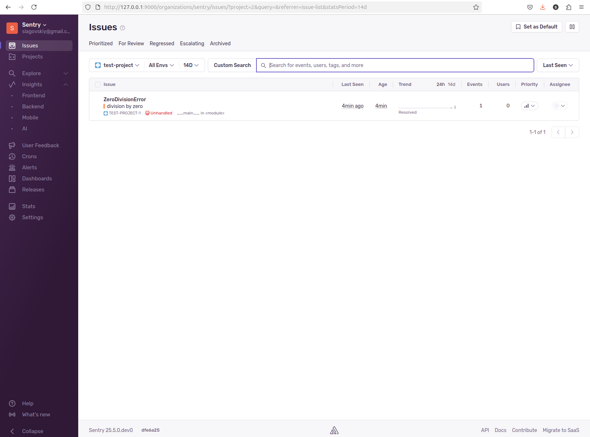
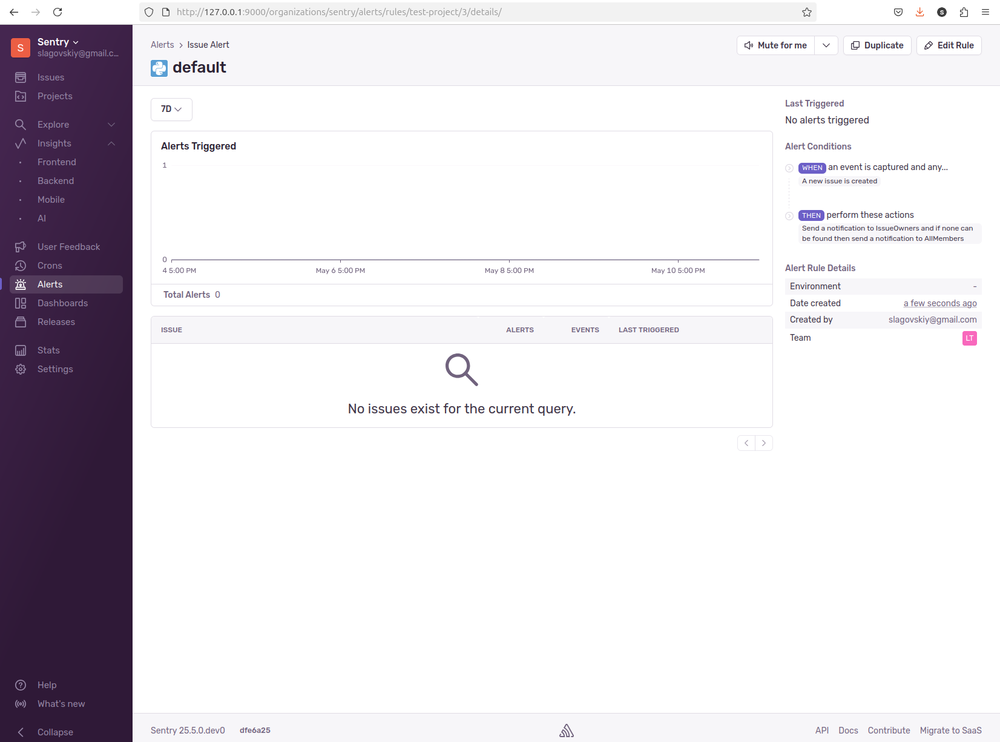

# Домашнее задание к занятию 16 «Платформа мониторинга Sentry»

## Задание 1

Так как Self-Hosted Sentry довольно требовательная к ресурсам система, мы будем использовать Free Сloud account.

Free Cloud account имеет ограничения:

- 5 000 errors;
- 10 000 transactions;
- 1 GB attachments.

Для подключения Free Cloud account:

- зайдите на sentry.io;
- нажмите «Try for free»;
- используйте авторизацию через ваш GitHub-аккаунт;
- далее следуйте инструкциям.

В качестве решения задания пришлите скриншот меню Projects.

## Решение

Sentry поднимал локально :) очень эпично

```
docker ps

CONTAINER ID   IMAGE                                    COMMAND                  CREATED          STATUS                    PORTS                                     NAMES
933df993f0a7   nginx:1.25.4-alpine                      "/docker-entrypoint.…"   12 minutes ago   Up 8 minutes              0.0.0.0:9000->80/tcp, [::]:9000->80/tcp   sentry-self-hosted-nginx-1
b07d826459cb   getsentry/relay:nightly                  "/bin/bash /docker-e…"   12 minutes ago   Up 8 minutes              3000/tcp                                  sentry-self-hosted-relay-1
d7d68291c9bb   getsentry/snuba:nightly                  "./docker_entrypoint…"   12 minutes ago   Up 12 minutes             1218-1219/tcp                             sentry-self-hosted-snuba-issue-occurrence-consumer-1
62abb6ba5439   getsentry/snuba:nightly                  "./docker_entrypoint…"   12 minutes ago   Up 12 minutes             1218-1219/tcp                             sentry-self-hosted-snuba-transactions-consumer-1
32079b829dd0   sentry-self-hosted-local                 "/etc/sentry/entrypo…"   12 minutes ago   Up 12 minutes (healthy)   9000/tcp                                  sentry-self-hosted-web-1
b81655fe745f   getsentry/snuba:nightly                  "./docker_entrypoint…"   12 minutes ago   Up 12 minutes             1218-1219/tcp                             sentry-self-hosted-snuba-replays-consumer-1
f12792c9214c   sentry-self-hosted-local                 "/etc/sentry/entrypo…"   12 minutes ago   Up 12 minutes             9000/tcp                                  sentry-self-hosted-post-process-forwarder-transactions-1
a367523dcc36   sentry-self-hosted-local                 "/etc/sentry/entrypo…"   12 minutes ago   Up 12 minutes             9000/tcp                                  sentry-self-hosted-subscription-consumer-transactions-1
de5f1e81ddb9   getsentry/snuba:nightly                  "./docker_entrypoint…"   12 minutes ago   Up 12 minutes             1218-1219/tcp                             sentry-self-hosted-snuba-generic-metrics-gauges-consumer-1
e56726e90d0f   sentry-self-hosted-local                 "/etc/sentry/entrypo…"   12 minutes ago   Up 12 minutes             9000/tcp                                  sentry-self-hosted-worker-1
96ba5d6b68f1   getsentry/snuba:nightly                  "./docker_entrypoint…"   12 minutes ago   Up 12 minutes             1218-1219/tcp                             sentry-self-hosted-snuba-generic-metrics-sets-consumer-1
dda6cd5df856   sentry-self-hosted-local                 "/etc/sentry/entrypo…"   12 minutes ago   Up 12 minutes             9000/tcp                                  sentry-self-hosted-monitors-clock-tasks-1
8b56576ff8d1   sentry-self-hosted-local                 "/etc/sentry/entrypo…"   12 minutes ago   Up 12 minutes             9000/tcp                                  sentry-self-hosted-events-consumer-1
a5b78ad44a38   getsentry/snuba:nightly                  "./docker_entrypoint…"   12 minutes ago   Up 12 minutes             1218-1219/tcp                             sentry-self-hosted-snuba-generic-metrics-distributions-consumer-1
90630763ad66   getsentry/snuba:nightly                  "./docker_entrypoint…"   12 minutes ago   Up 12 minutes             1218-1219/tcp                             sentry-self-hosted-snuba-profiling-profiles-consumer-1
9f32894012d5   sentry-self-hosted-local                 "/etc/sentry/entrypo…"   12 minutes ago   Up 12 minutes             9000/tcp                                  sentry-self-hosted-ingest-occurrences-1
fd41b8e07a31   getsentry/snuba:nightly                  "./docker_entrypoint…"   12 minutes ago   Up 12 minutes             1218-1219/tcp                             sentry-self-hosted-snuba-subscription-consumer-transactions-1
f3b4cc351088   getsentry/snuba:nightly                  "./docker_entrypoint…"   12 minutes ago   Up 12 minutes             1218-1219/tcp                             sentry-self-hosted-snuba-replacer-1
728495fdf0a6   sentry-self-hosted-local                 "/etc/sentry/entrypo…"   12 minutes ago   Up 12 minutes             9000/tcp                                  sentry-self-hosted-metrics-consumer-1
5cd69397f73f   sentry-self-hosted-local                 "/etc/sentry/entrypo…"   12 minutes ago   Up 12 minutes             9000/tcp                                  sentry-self-hosted-ingest-monitors-1
052843c5fab7   sentry-self-hosted-local                 "/etc/sentry/entrypo…"   12 minutes ago   Up 12 minutes             9000/tcp                                  sentry-self-hosted-subscription-consumer-metrics-1
4ab3ddb7f8e3   sentry-self-hosted-local                 "/etc/sentry/entrypo…"   12 minutes ago   Up 12 minutes             9000/tcp                                  sentry-self-hosted-cron-1
29d3e8435324   getsentry/snuba:nightly                  "./docker_entrypoint…"   12 minutes ago   Up 12 minutes             1218-1219/tcp                             sentry-self-hosted-snuba-outcomes-billing-consumer-1
15010053d95a   sentry-self-hosted-local                 "/etc/sentry/entrypo…"   12 minutes ago   Up 12 minutes             9000/tcp                                  sentry-self-hosted-ingest-feedback-events-1
f5d05a60a5d2   sentry-self-hosted-local                 "/etc/sentry/entrypo…"   12 minutes ago   Up 12 minutes             9000/tcp                                  sentry-self-hosted-post-process-forwarder-errors-1
640b77c77ee6   sentry-self-hosted-local                 "/etc/sentry/entrypo…"   12 minutes ago   Up 12 minutes             9000/tcp                                  sentry-self-hosted-generic-metrics-consumer-1
6d89bac0b4e6   getsentry/snuba:nightly                  "./docker_entrypoint…"   12 minutes ago   Up 12 minutes             1218-1219/tcp                             sentry-self-hosted-snuba-group-attributes-consumer-1
6462eaeeecd6   sentry-self-hosted-local                 "/etc/sentry/entrypo…"   12 minutes ago   Up 12 minutes             9000/tcp                                  sentry-self-hosted-billing-metrics-consumer-1
a0437bd5beae   sentry-self-hosted-local                 "/etc/sentry/entrypo…"   12 minutes ago   Up 12 minutes             9000/tcp                                  sentry-self-hosted-subscription-consumer-events-1
d135c80eb101   sentry-cleanup-self-hosted-local         "/entrypoint.sh '0 0…"   12 minutes ago   Up 12 minutes             9000/tcp                                  sentry-self-hosted-sentry-cleanup-1
e49e4db72801   getsentry/snuba:nightly                  "./docker_entrypoint…"   12 minutes ago   Up 12 minutes             1218-1219/tcp                             sentry-self-hosted-snuba-subscription-consumer-metrics-1
d454dfb8f215   sentry-self-hosted-local                 "/etc/sentry/entrypo…"   12 minutes ago   Up 12 minutes             9000/tcp                                  sentry-self-hosted-transactions-consumer-1
90d54903fa59   sentry-self-hosted-local                 "/etc/sentry/entrypo…"   12 minutes ago   Up 12 minutes             9000/tcp                                  sentry-self-hosted-post-process-forwarder-issue-platform-1
5c2690faa68c   sentry-self-hosted-local                 "/etc/sentry/entrypo…"   12 minutes ago   Up 12 minutes             9000/tcp                                  sentry-self-hosted-subscription-consumer-generic-metrics-1
10dd3fac7f2b   sentry-self-hosted-local                 "/etc/sentry/entrypo…"   12 minutes ago   Up 12 minutes             9000/tcp                                  sentry-self-hosted-monitors-clock-tick-1
6f51d15d55c0   getsentry/snuba:nightly                  "./docker_entrypoint…"   12 minutes ago   Up 12 minutes             1218-1219/tcp                             sentry-self-hosted-snuba-metrics-consumer-1
e3e3920dc657   sentry-self-hosted-local                 "/etc/sentry/entrypo…"   12 minutes ago   Up 12 minutes             9000/tcp                                  sentry-self-hosted-ingest-replay-recordings-1
7dd0b01d329e   sentry-self-hosted-local                 "/etc/sentry/entrypo…"   12 minutes ago   Up 12 minutes             9000/tcp                                  sentry-self-hosted-attachments-consumer-1
85f479b27498   getsentry/snuba:nightly                  "./docker_entrypoint…"   12 minutes ago   Up 12 minutes             1218-1219/tcp                             sentry-self-hosted-snuba-spans-consumer-1
4da76e3aa359   getsentry/snuba:nightly                  "./docker_entrypoint…"   12 minutes ago   Up 12 minutes             1218-1219/tcp                             sentry-self-hosted-snuba-errors-consumer-1
526ba883b427   getsentry/snuba:nightly                  "./docker_entrypoint…"   12 minutes ago   Up 12 minutes             1218-1219/tcp                             sentry-self-hosted-snuba-outcomes-consumer-1
46abda3c70d7   sentry-self-hosted-local                 "/etc/sentry/entrypo…"   12 minutes ago   Up 12 minutes             9000/tcp                                  sentry-self-hosted-ingest-profiles-1
2aaa2a65bdc2   getsentry/snuba:nightly                  "./docker_entrypoint…"   12 minutes ago   Up 12 minutes             1218-1219/tcp                             sentry-self-hosted-snuba-generic-metrics-counters-consumer-1
de87fd6a9c1e   getsentry/snuba:nightly                  "./docker_entrypoint…"   12 minutes ago   Up 12 minutes             1218-1219/tcp                             sentry-self-hosted-snuba-profiling-functions-consumer-1
4334b0ddbf0d   getsentry/snuba:nightly                  "./docker_entrypoint…"   12 minutes ago   Up 12 minutes             1218-1219/tcp                             sentry-self-hosted-snuba-subscription-consumer-events-1
4ebd15150c42   getsentry/vroom:nightly                  "/bin/vroom"             12 minutes ago   Up 12 minutes             8080/tcp                                  sentry-self-hosted-vroom-1
76f50725ccdd   vroom-cleanup-self-hosted-local          "/entrypoint.sh '0 0…"   12 minutes ago   Up 12 minutes             8080/tcp                                  sentry-self-hosted-vroom-cleanup-1
6eae3db6fee1   symbolicator-cleanup-self-hosted-local   "/entrypoint.sh '55 …"   12 minutes ago   Up 12 minutes             3021/tcp                                  sentry-self-hosted-symbolicator-cleanup-1
0cc7850eecde   getsentry/symbolicator:nightly           "/bin/bash /docker-e…"   17 minutes ago   Up 12 minutes             3021/tcp                                  sentry-self-hosted-symbolicator-1
9e80f9de1621   getsentry/snuba:nightly                  "./docker_entrypoint…"   17 minutes ago   Up 12 minutes             1218-1219/tcp                             sentry-self-hosted-snuba-api-1
da529faf7f6b   memcached:1.6.26-alpine                  "docker-entrypoint.s…"   17 minutes ago   Up 12 minutes (healthy)   11211/tcp                                 sentry-self-hosted-memcached-1
a90acca45e23   tianon/exim4                             "docker-entrypoint.s…"   17 minutes ago   Up 12 minutes             25/tcp                                    sentry-self-hosted-smtp-1
aa75ab1c30c5   postgres:14.11                           "docker-entrypoint.s…"   17 minutes ago   Up 12 minutes (healthy)   5432/tcp                                  sentry-self-hosted-postgres-1
ac077098e44b   confluentinc/cp-kafka:7.6.1              "/etc/confluent/dock…"   17 minutes ago   Up 12 minutes (healthy)   9092/tcp                                  sentry-self-hosted-kafka-1
1d044c6d829a   clickhouse-self-hosted-local             "/entrypoint.sh"         17 minutes ago   Up 12 minutes (healthy)   8123/tcp, 9000/tcp, 9009/tcp              sentry-self-hosted-clickhouse-1
b33d1f6bfa88   redis:6.2.14-alpine                      "docker-entrypoint.s…"   17 minutes ago   Up 12 minutes (healthy)   6379/tcp                                  sentry-self-hosted-redis-1
```



## Задание 2

1. Создайте python-проект и нажмите `Generate sample event` для генерации тестового события.
1. Изучите информацию, представленную в событии.
1. Перейдите в список событий проекта, выберите созданное вами и нажмите `Resolved`.
1. В качестве решения задание предоставьте скриншот `Stack trace` из этого события и список событий проекта после нажатия `Resolved`.

В проекте допускаем ошибку

'''
$ python main.py 

Traceback (most recent call last):
  File "/home/sergey/Work/netology-devops/monitoring/10-monitoring-05-sentry/project/main.py", line 10, in <module>
    div_zero = 1 / 0
               ~~^~~
ZeroDivisionError: division by zero

'''





## Задание 3

1. Перейдите в создание правил алёртинга.
2. Выберите проект и создайте дефолтное правило алёртинга без настройки полей.
3. Снова сгенерируйте событие `Generate sample event`.
Если всё было выполнено правильно — через некоторое время вам на почту, привязанную к GitHub-аккаунту, придёт оповещение о произошедшем событии.
4. Если сообщение не пришло — проверьте настройки аккаунта Sentry (например, привязанную почту), что у вас не было 
`sample issue` до того, как вы его сгенерировали, и то, что правило алёртинга выставлено по дефолту (во всех полях all).
Также проверьте проект, в котором вы создаёте событие — возможно алёрт привязан к другому.
5. В качестве решения задания пришлите скриншот тела сообщения из оповещения на почте.
6. Дополнительно поэкспериментируйте с правилами алёртинга. Выбирайте разные условия отправки и создавайте sample events. 



А показать письмо - тут только "понять и простить"... :)

все здравомыслящие почтовики заворачивают письма, которые идут с домовых сетей. Да, можно потащить все это в клауд и там еще полтора часа ждать когда оно поднимется, но спать пора, я точно знаю, что оно работает ;)

## Задание повышенной сложности

1. Создайте проект на ЯП Python или GO (около 10–20 строк), подключите к нему sentry SDK и отправьте несколько тестовых событий.
2. Поэкспериментируйте с различными передаваемыми параметрами, но помните об ограничениях Free учётной записи Cloud Sentry.
3. В качестве решения задания пришлите скриншот меню issues вашего проекта и пример кода подключения sentry sdk/отсылки событий.

---

### Как оформить решение задания

Выполненное домашнее задание пришлите в виде ссылки на .md-файл в вашем репозитории.

---
