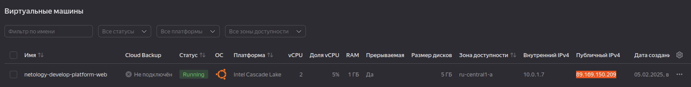
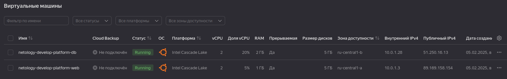

# Домашнее задание к занятию «Основы Terraform. Yandex Cloud»

### Задание 1
В качестве ответа всегда полностью прикладывайте ваш terraform-код в git.
Убедитесь что ваша версия **Terraform** ~>1.8.4

> 1. Изучите проект. В файле variables.tf объявлены переменные для Yandex provider.
> 2. Создайте сервисный аккаунт и ключ. [service_account_key_file](https://terraform-provider.yandexcloud.net).

```
$ yc iam service-account create --name terra

$ yc iam service-account list
+----------------------+-------+--------+---------------------+-----------------------+
|          ID          | NAME  | LABELS |     CREATED AT      | LAST AUTHENTICATED AT |
+----------------------+-------+--------+---------------------+-----------------------+
| ******************** | terra |        | 2025-02-05 13:30:57 |                       |
+----------------------+-------+--------+---------------------+-----------------------+

$ yc resource-manager folder add-access-binding ****************** --role admin --subject serviceAccount:*******************

done (3s)
effective_deltas:
  - action: ADD
    access_binding:
      role_id: admin
      subject:
        id: ajeksvicm9mgluiniav6
        type: serviceAccount


$ yc iam key create --service-account-id ************ --folder-name default --output ~/.authorized_key.json

id: ************
service_account_id: ************
created_at: "2025-02-05T14:03:05.405573456Z"
key_algorithm: RSA_2048

```

> 4. Сгенерируйте новый или используйте свой текущий ssh-ключ. Запишите его открытую(public) часть в переменную **vms_ssh_public_root_key**.

```
$ cat ~/.ssh/yandex_cloud.pub 
ssh-ed25519 AAAAC3NzaC1lZDI1NTE5AAAAIOrN2UcKehwx9WssN1HAp/IUwMxlvrfLLXZuyrvqGgyr yc
```

> 5. Инициализируйте проект, выполните код. Исправьте намеренно допущенные синтаксические ошибки. Ищите внимательно, посимвольно. Ответьте, в чём заключается их суть.

platform_id = "standart-v4" -> platform_id = "standard-v2"

Видать человек страдает дислексией

cores         = 1 -> cores         = 2

Минимально можно только 2 ядра

> 6. Подключитесь к консоли ВМ через ssh и выполните команду ``` curl ifconfig.me```.

```
$ ssh ubuntu@89.169.150.209

The authenticity of host '89.169.150.209 (89.169.150.209)' can't be established.
ED25519 key fingerprint is SHA256:E6wvEAzxGUxub5wnGNr3IJPwjdjsOLn5dfcD9vQChUc.
This key is not known by any other names
Are you sure you want to continue connecting (yes/no/[fingerprint])? yes
Warning: Permanently added '89.169.150.209' (ED25519) to the list of known hosts.
Welcome to Ubuntu 20.04.6 LTS (GNU/Linux 5.4.0-204-generic x86_64)

 * Documentation:  https://help.ubuntu.com
 * Management:     https://landscape.canonical.com
 * Support:        https://ubuntu.com/pro

The programs included with the Ubuntu system are free software;
the exact distribution terms for each program are described in the
individual files in /usr/share/doc/*/copyright.

Ubuntu comes with ABSOLUTELY NO WARRANTY, to the extent permitted by
applicable law.

To run a command as administrator (user "root"), use "sudo <command>".
See "man sudo_root" for details.

$ curl ifconfig.me

89.169.150.209
```

> 8. Ответьте, как в процессе обучения могут пригодиться параметры ```preemptible = true``` и ```core_fraction=5``` в параметрах ВМ.

Получишь опыт работы на очень медленной машине, плюс ее и выключать будут для тебя, зато деньги со счета будут списывать экономнее.



### Задание 2

> 1. Замените все хардкод-**значения** для ресурсов **yandex_compute_image** и **yandex_compute_instance** на **отдельные** переменные. К названиям переменных ВМ добавьте в начало префикс **vm_web_** .  Пример: **vm_web_name**.
> 2. Объявите нужные переменные в файле variables.tf, обязательно указывайте тип переменной. Заполните их **default** прежними значениями из main.tf. 
> 3. Проверьте terraform plan. Изменений быть не должно. 

хардкод

variables.tf

```
variable "vm_web_name" {
  type        = string
  default     = "netology-develop-platform-web"
  description = "Name for vm web"
}
variable "vm_web_platform" {
  type        = string
  default     = "standard-v2"
  description = "Platform"
}
variable "vm_web_resources_codes" {
  type        = number
  default = 2
}

variable "vm_web_resources_memmory" {
  type        = number
  default     = 1
}

variable "vm_web_resources_core_fraction" {
  type        = number
  default     = 5
}

variable "vm_web_metadata serial_port_enable" {
  type    = string
  default = "1"
}

variable "vm_web_metadata_ssh_keys" {
  type    = string
  default = "ubuntu:ssh-ed25519 AAAAC3NzaC1lZDI1NTE5AAAAIOrN2UcKehwx9WssN1HAp/IUwMxlvrfLLXZuyrvqGgyr yc"
}


variable "vm_web_policy_preemptible" {
  type        = bool
  default     = true
  description = "If the instance is preemptible"
}
variable "vm_web_network_nat" {
  type        = bool
  default     = true
  description = "Provide a public address, for instance, to access the internet over NAT"
}
```

main.tf

```
resource "yandex_compute_instance" "platform" {
  name        = var.vm_web_name
  platform_id = var.vm_web_platform
  resources {
    cores         = var.vm_web_resources_cores
    memory        = var.vm_web_resources_memory
    core_fraction = var.vm_web_resources_core_fraction
  }
  boot_disk {
    initialize_params {
      image_id = data.yandex_compute_image.ubuntu.image_id
    }
  }
  scheduling_policy {
    preemptible = var.vm_web_policy_preemptible
  }
  network_interface {
    subnet_id = yandex_vpc_subnet.develop.id
    nat       = var.vm_web_network_nat
  }

  metadata = {
    serial-port-enable = var.vm_web_metadata_serial_port_enable
    ssh-keys           = var.vm_web_metadata_ssh_keys
  }
}
```

console

```
$ terraform validate

Success! The configuration is valid.

$ terraform apply

data.yandex_compute_image.ubuntu: Reading...
yandex_vpc_network.develop: Refreshing state... [id=enpmtg5v6pmeg3e4pmkn]
data.yandex_compute_image.ubuntu: Read complete after 0s [id=fd8s6inq8cb33bdkk93k]
yandex_vpc_subnet.develop: Refreshing state... [id=e9bjf8685io3vdcllr0g]
yandex_compute_instance.platform: Refreshing state... [id=fhmr747tinupsha1hkug]

No changes. Your infrastructure matches the configuration.

Terraform has compared your real infrastructure against your configuration and found no differences, so no changes are needed.

Apply complete! Resources: 0 added, 0 changed, 0 destroyed.

```

### Задание 3

> 1. Создайте в корне проекта файл 'vms_platform.tf' . Перенесите в него все переменные первой ВМ.
> 2. Скопируйте блок ресурса и создайте с его помощью вторую ВМ в файле main.tf: **"netology-develop-platform-db"** ,  ```cores  = 2, memory = 2, core_fraction = 20```. Объявите её переменные с префиксом **vm_db_** в том же файле ('vms_platform.tf').  ВМ должна работать в зоне "ru-central1-b"
> 3. Примените изменения.

vms_platform.tf

```
variable "zone_a" {
  type        = string
  default     = "ru-central1-a"
  description = "https://cloud.yandex.ru/docs/overview/concepts/geo-scope"
}

variable "zone_b" {
  type        = string
  default     = "ru-central1-b"
  description = "https://cloud.yandex.ru/docs/overview/concepts/geo-scope"
}

variable "vpc_name" {
  type        = string
  default     = "develop"
  description = "VPC network & subnet name"
}

variable "vpc_name_b" {
  type        = string
  default     = "develop_b"
  description = "VPC network & subnet name"
}

variable "vm_web_name" {
  type        = string
  default     = "netology-develop-platform-web"
  description = "Name for vm web"
}
variable "vm_web_platform" {
  type        = string
  default     = "standard-v2"
  description = "Platform"
}

variable "vm_web_policy_preemptible" {
  type        = bool
  default     = true
  description = "If the instance is preemptible"
}
variable "vm_web_network_nat" {
  type        = bool
  default     = true
  description = "Provide a public address, for instance, to access the internet over NAT"
}

variable "vm_web_metadata serial_port_enable" {
  type    = string
  default = "1"
}

variable "vm_web_metadata_ssh_keys" {
  type    = string
  default = "ubuntu:ssh-ed25519 AAAAC3NzaC1lZDI1NTE5AAAAIOrN2UcKehwx9WssN1HAp/IUwMxlvrfLLXZuyrvqGgyr yc"
}


variable "vm_db_name" {
  type        = string
  default     = "netology-develop-platform-db"
  description = "Name for vm db"
}
variable "vm_db_platform" {
  type        = string
  default     = "standard-v2"
  description = "Platform"
}

variable "vm_db_policy_preemptible" {
  type        = bool
  default     = true
  description = "If the instance is preemptible"
}
variable "vm_db_network_nat" {
  type        = bool
  default     = true
  description = "Provide a public address, for instance, to access the internet over NAT"
}

variable "vm_db_metadata_serial_port_enable" {
  type    = string
  default = "1"
}

variable "vm_db_metadata_serial_ssh_keys" {
  type    = string
  default = "ubuntu:ssh-ed25519 AAAAC3NzaC1lZDI1NTE5AAAAIOrN2UcKehwx9WssN1HAp/IUwMxlvrfLLXZuyrvqGgyr yc"
}


variable "vm_web_resources_codes" {
  type        = number
  default = 2
}

variable "vm_web_resources_memmory" {
  type        = number
  default     = 1
}

variable "vm_web_resources_core_fraction" {
  type        = number
  default     = 5
}

variable "vm_db_resources_codes" {
  type        = number
  default = 2
}

variable "vm_db_resources_memmory" {
  type        = number
  default     = 1
}

variable "vm_db_resources_core_fraction" {
  type        = number
  default     = 5
}
```

main.tf

```
resource "yandex_vpc_network" "develop" {
  name = var.vpc_name
}

resource "yandex_vpc_network" "develop_b" {
  name = var.vpc_name_b
}

resource "yandex_vpc_subnet" "develop" {
  name           = var.vpc_name
  zone           = var.zone_a
  network_id     = yandex_vpc_network.develop.id
  v4_cidr_blocks = var.default_cidr
}

resource "yandex_vpc_subnet" "develop_b" {
  name           = var.vpc_name_b
  zone           = var.zone_b
  network_id     = yandex_vpc_network.develop_b.id
  v4_cidr_blocks = var.default_cidr
}


data "yandex_compute_image" "ubuntu" {
  family = "ubuntu-2004-lts"
}

resource "yandex_compute_instance" "platform" {
  name        = var.vm_web_name
  platform_id = var.vm_web_platform
  zone        = var.zone_a
  resources {
    cores         = var.vm_web_resources_cores
    memory        = var.vm_web_resources_memory
    core_fraction = var.vm_web_resources_core_fraction
  }
  boot_disk {
    initialize_params {
      image_id = data.yandex_compute_image.ubuntu.image_id
    }
  }
  scheduling_policy {
    preemptible = var.vm_web_policy_preemptible
  }
  network_interface {
    subnet_id = yandex_vpc_subnet.develop.id
    nat       = var.vm_web_network_nat
  }

  metadata = {
    serial-port-enable = var.vm_web_metadata_serial_port_enable
    ssh-keys           = var.vm_web_metadata_ssh_keys
  }
}


resource "yandex_compute_instance" "platform2" {
  name        = var.vm_db_name
  platform_id = var.vm_db_platform
  zone        = var.zone_b
  resources {
    cores         = var.vm_db_resources_cores
    memory        = var.vm_db_resources_memory
    core_fraction = var.vm_db_resources_core_fraction
  }
  boot_disk {
    initialize_params {
      image_id = data.yandex_compute_image.ubuntu.image_id
    }
  }
  scheduling_policy {
    preemptible = var.vm_db_policy_preemptible
  }
  network_interface {
    subnet_id = yandex_vpc_subnet.develop_b.id
    nat       = var.vm_db_network_nat
  }

  metadata = {
    serial-port-enable = var.vm_db_metadata_serial_port_enable
    ssh-keys           = var.vm_db_metadata_ssh_keys
  }
}
```




### Задание 4

> 1. Объявите в файле outputs.tf **один** output , содержащий: instance_name, external_ip, fqdn для каждой из ВМ в удобном лично для вас формате.(без хардкода!!!)
> 2. Примените изменения.

> В качестве решения приложите вывод значений ip-адресов команды ```terraform output```.

```
output "instance_info" {
  value = [yandex_compute_instance.platform.name,
    yandex_compute_instance.platform.fqdn,
    yandex_compute_instance.platform.network_interface[0].nat_ip_address,
    yandex_compute_instance.platform_2.name,
    yandex_compute_instance.platform_2.fqdn,
  yandex_compute_instance.platform_2.network_interface[0].nat_ip_address]
}
```

```
$ terraform output

instance_info = [
  "netology-develop-platform-web",
  "fhmvsmf7jbk7gghsdgsr.auto.internal",
  "89.169.158.154",
  "netology-develop-platform-db",
  "epdl6lo1ur7tr7d9u9st.auto.internal",
  "51.250.16.13",
]
```


### Задание 5

> 1. В файле locals.tf опишите в **одном** local-блоке имя каждой ВМ, используйте интерполяцию ${..} с НЕСКОЛЬКИМИ переменными по примеру из лекции.
> 2. Замените переменные внутри ресурса ВМ на созданные вами local-переменные.
> 3. Примените изменения.

locals.tf

```
locals {
  first_name   = "netology-develop-platform"
  sub_name_web = "web"
  sub_name_db  = "db"
  vm_web_name  = "${local.first_name}-${local.sub_name_web}"
  vm_db_name   = "${local.first_name}-${local.sub_name_db}"
}
```


### Задание 6

> 1. Вместо использования трёх переменных  ".._cores",".._memory",".._core_fraction" в блоке  resources {...}, объедините их в единую map-переменную **vms_resources** и  внутри неё конфиги обеих ВМ в виде вложенного map(object).  
   ```
   пример из terraform.tfvars:
   vms_resources = {
     web={
       cores=2
       memory=2
       core_fraction=5
       hdd_size=10
       hdd_type="network-hdd"
       ...
     },
     db= {
       cores=2
       memory=4
       core_fraction=20
       hdd_size=10
       hdd_type="network-ssd"
       ...
     }
   }
   ```
> 3. Создайте и используйте отдельную map(object) переменную для блока metadata, она должна быть общая для всех ваших ВМ.
  ```
   пример из terraform.tfvars:
   metadata = {
     serial-port-enable = 1
     ssh-keys           = "ubuntu:ssh-ed25519 AAAAC..."
   }
   ```  
  
> 5. Найдите и закоментируйте все, более не используемые переменные проекта.
> 6. Проверьте terraform plan. Изменений быть не должно.


```
variable "vm_resources" {
  type        = map(map(number))
  description = "Resources for VM"
  default = {
    web = {
      cores         = 2
      memory        = 1
      core_fraction = 5
    },
    db = {
      cores         = 2
      memory        = 2
      core_fraction = 20
    }

  }
}

variable "vm_metadata" {
  type        = map(string)
  description = "Metadata map for VMs"
  default = {
    serial_port_enable = "1"
    ssh_keys           = "ubuntu:ssh-ed25519 AAAAC3NzaC1lZDI1NTE5AAAAIOrN2UcKehwx9WssN1HAp/IUwMxlvrfLLXZuyrvqGgyr yc"
  }
}
```


```
$ terraform plan

data.yandex_compute_image.ubuntu: Reading...
yandex_vpc_network.develop: Refreshing state... [id=enpc4nlikfdgfocc7c41]
yandex_vpc_network.develop_b: Refreshing state... [id=enpc9in8klnn8mlvnngs]
data.yandex_compute_image.ubuntu: Read complete after 1s [id=fd8s6inq8cb33bdkk93k]
yandex_vpc_subnet.develop_b: Refreshing state... [id=e2lfo4a23nn9fgvt2ep5]
yandex_vpc_subnet.develop: Refreshing state... [id=e9bj87jg94tgj8jj2g54]
yandex_compute_instance.platform2: Refreshing state... [id=epdl6lo1ur7tr7d9u9st]
yandex_compute_instance.platform: Refreshing state... [id=fhmvsmf7jbk7gghsdgsr]

No changes. Your infrastructure matches the configuration.

Terraform has compared your real infrastructure against your configuration and found no differences, so no changes are needed.
```


------

## Дополнительное задание (со звёздочкой*)

**Настоятельно рекомендуем выполнять все задания со звёздочкой.**   
Они помогут глубже разобраться в материале. Задания со звёздочкой дополнительные, не обязательные к выполнению и никак не повлияют на получение вами зачёта по этому домашнему заданию. 


------
### Задание 7*

Изучите содержимое файла console.tf. Откройте terraform console, выполните следующие задания: 

1. Напишите, какой командой можно отобразить **второй** элемент списка test_list.
2. Найдите длину списка test_list с помощью функции length(<имя переменной>).
3. Напишите, какой командой можно отобразить значение ключа admin из map test_map.
4. Напишите interpolation-выражение, результатом которого будет: "John is admin for production server based on OS ubuntu-20-04 with X vcpu, Y ram and Z virtual disks", используйте данные из переменных test_list, test_map, servers и функцию length() для подстановки значений.

**Примечание**: если не догадаетесь как вычленить слово "admin", погуглите: "terraform get keys of map"

В качестве решения предоставьте необходимые команды и их вывод.

------

### Задание 8*
1. Напишите и проверьте переменную test и полное описание ее type в соответствии со значением из terraform.tfvars:
```
test = [
  {
    "dev1" = [
      "ssh -o 'StrictHostKeyChecking=no' ubuntu@62.84.124.117",
      "10.0.1.7",
    ]
  },
  {
    "dev2" = [
      "ssh -o 'StrictHostKeyChecking=no' ubuntu@84.252.140.88",
      "10.0.2.29",
    ]
  },
  {
    "prod1" = [
      "ssh -o 'StrictHostKeyChecking=no' ubuntu@51.250.2.101",
      "10.0.1.30",
    ]
  },
]
```
2. Напишите выражение в terraform console, которое позволит вычленить строку "ssh -o 'StrictHostKeyChecking=no' ubuntu@62.84.124.117" из этой переменной.
------

------

### Задание 9*

Используя инструкцию https://cloud.yandex.ru/ru/docs/vpc/operations/create-nat-gateway#tf_1, настройте для ваших ВМ nat_gateway. Для проверки уберите внешний IP адрес (nat=false) у ваших ВМ и проверьте доступ в интернет с ВМ, подключившись к ней через serial console. Для подключения предварительно через ssh измените пароль пользователя: ```sudo passwd ubuntu```

### Правила приёма работыДля подключения предварительно через ssh измените пароль пользователя: sudo passwd ubuntu
В качестве результата прикрепите ссылку на MD файл с описанием выполненой работы в вашем репозитории. Так же в репозитории должен присутсвовать ваш финальный код проекта.

**Важно. Удалите все созданные ресурсы**.


### Критерии оценки

Зачёт ставится, если:

* выполнены все задания,
* ответы даны в развёрнутой форме,
* приложены соответствующие скриншоты и файлы проекта,
* в выполненных заданиях нет противоречий и нарушения логики.

На доработку работу отправят, если:

* задание выполнено частично или не выполнено вообще,
* в логике выполнения заданий есть противоречия и существенные недостатки. 

