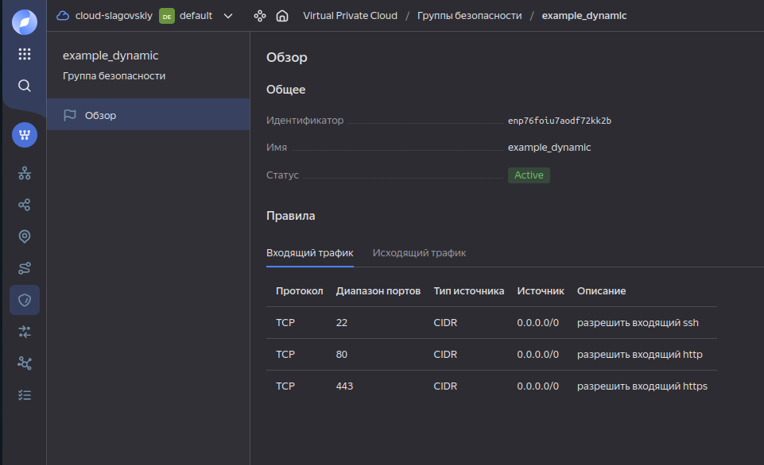

# Домашнее задание к занятию «Управляющие конструкции в коде Terraform»

------

### Задание 1

1. Изучите проект.
2. Инициализируйте проект, выполните код. 


Приложите скриншот входящих правил «Группы безопасности» в ЛК Yandex Cloud .


------

### Задание 2

1. Создайте файл count-vm.tf. Опишите в нём создание двух **одинаковых** ВМ  web-1 и web-2 (не web-0 и web-1) с минимальными параметрами, используя мета-аргумент **count loop**. Назначьте ВМ созданную в первом задании группу безопасности.(как это сделать узнайте в документации провайдера yandex/compute_instance )
2. Создайте файл for_each-vm.tf. Опишите в нём создание двух ВМ для баз данных с именами "main" и "replica" **разных** по cpu/ram/disk_volume , используя мета-аргумент **for_each loop**. Используйте для обеих ВМ одну общую переменную типа:
```
variable "each_vm" {
  type = list(object({  vm_name=string, cpu=number, ram=number, disk_volume=number }))
}
```  
При желании внесите в переменную все возможные параметры.
4. ВМ из пункта 2.1 должны создаваться после создания ВМ из пункта 2.2.
5. Используйте функцию file в local-переменной для считывания ключа ~/.ssh/id_rsa.pub и его последующего использования в блоке metadata, взятому из ДЗ 2.
6. Инициализируйте проект, выполните код.

```
yandex_compute_instance.db["replica"]: Creating...
yandex_compute_instance.db["main"]: Creating...
yandex_compute_instance.db["replica"]: Still creating... [10s elapsed]
yandex_compute_instance.db["main"]: Still creating... [10s elapsed]
yandex_compute_instance.db["replica"]: Still creating... [20s elapsed]
yandex_compute_instance.db["main"]: Still creating... [20s elapsed]
yandex_compute_instance.db["replica"]: Still creating... [30s elapsed]
yandex_compute_instance.db["main"]: Still creating... [30s elapsed]
yandex_compute_instance.db["replica"]: Still creating... [40s elapsed]
yandex_compute_instance.db["main"]: Still creating... [40s elapsed]
yandex_compute_instance.db["replica"]: Creation complete after 41s [id=fhmlljlfri4ge1l1lsqs]
yandex_compute_instance.db["main"]: Creation complete after 43s [id=fhm3tjf8of8jmp4b93a8]
yandex_compute_instance.web[1]: Creating...
yandex_compute_instance.web[0]: Creating...
yandex_compute_instance.web[1]: Still creating... [10s elapsed]
yandex_compute_instance.web[0]: Still creating... [10s elapsed]
yandex_compute_instance.web[1]: Still creating... [20s elapsed]
yandex_compute_instance.web[0]: Still creating... [20s elapsed]
yandex_compute_instance.web[0]: Still creating... [30s elapsed]
yandex_compute_instance.web[1]: Still creating... [30s elapsed]
yandex_compute_instance.web[1]: Still creating... [40s elapsed]
yandex_compute_instance.web[0]: Still creating... [40s elapsed]
yandex_compute_instance.web[0]: Creation complete after 43s [id=fhmknt1n0a9cqgngl26q]
yandex_compute_instance.web[1]: Still creating... [50s elapsed]
yandex_compute_instance.web[1]: Still creating... [1m0s elapsed]
yandex_compute_instance.web[1]: Still creating... [1m10s elapsed]
yandex_compute_instance.web[1]: Creation complete after 1m12s [id=fhmpqnb4jletoci34te6]
```

```
$ yc compute instance list
+----------------------+---------+---------------+---------+-----------------+-------------+
|          ID          |  NAME   |    ZONE ID    | STATUS  |   EXTERNAL IP   | INTERNAL IP |
+----------------------+---------+---------------+---------+-----------------+-------------+
| fhm3tjf8of8jmp4b93a8 | main    | ru-central1-a | RUNNING | 158.160.101.102 | 10.0.1.3    |
| fhmknt1n0a9cqgngl26q | web-1   | ru-central1-a | RUNNING |                 | 10.0.1.34   |
| fhmlljlfri4ge1l1lsqs | replica | ru-central1-a | RUNNING | 158.160.33.32   | 10.0.1.17   |
| fhmpqnb4jletoci34te6 | web-2   | ru-central1-a | RUNNING |                 | 10.0.1.31   |
+----------------------+---------+---------------+---------+-----------------+-------------+

```

```
$ cat count-vm.tf 
resource "yandex_compute_instance" "web" {
  depends_on = [yandex_compute_instance.db]

  count = var.counts

  name        = "${var.vms_name}-${count.index + 1}"
  platform_id = var.vms_resources.platform_id

  resources {
    cores         = var.vms_resources.cores
    memory        = var.vms_resources.memory
    core_fraction = var.vms_resources.core_fraction
  }

  boot_disk {
    initialize_params {
      image_id = data.yandex_compute_image.ubuntu.image_id
      type     = var.vms_resources.disk_type
      size     = var.vms_resources.disk_size
    }
  }

  metadata = {
    serial-port-enable = 1
    ssh-keys           = local.ssh_key
  }

  scheduling_policy { preemptible = var.vms_resources.preemptible }

  network_interface {
    subnet_id          = yandex_vpc_subnet.develop.id
    security_group_ids = [yandex_vpc_security_group.example.id]
  }
  allow_stopping_for_update = true
}
```

```
$ cat for_each-vm.tf 
resource "yandex_compute_instance" "db" {
  for_each = {
    main    = var.each_vm[0]
    replica = var.each_vm[1]
  }
  name        = each.value.vm_name
  platform_id = var.vms_resources.platform_id


  resources {
    cores         = each.value.cpu
    memory        = each.value.ram
    core_fraction = var.vms_resources.core_fraction
  }

  boot_disk {
    initialize_params {
      image_id = data.yandex_compute_image.ubuntu.image_id
      type     = var.vms_resources.disk_type
      size     = each.value.disk_volume
    }
  }

  metadata = {
    serial-port-enable = 1
    ssh-keys           = local.ssh_key
  }

  scheduling_policy { preemptible = var.vms_resources.preemptible }

  network_interface {
    subnet_id = yandex_vpc_subnet.develop.id
    nat       = var.vms_resources.nat
  }
  allow_stopping_for_update = true
}
```

```
$ cat locals.tf 
locals {
  ssh_key = file("~/.ssh/yandex_cloud.pub")
}
```

------

### Задание 3

1. Создайте 3 одинаковых виртуальных диска размером 1 Гб с помощью ресурса yandex_compute_disk и мета-аргумента count в файле **disk_vm.tf** .
2. Создайте в том же файле **одиночную**(использовать count или for_each запрещено из-за задания №4) ВМ c именем "storage"  . Используйте блок **dynamic secondary_disk{..}** и мета-аргумент for_each для подключения созданных вами дополнительных дисков.

```
$ cat disk_vm.tf 
resource "yandex_compute_disk" "disks" {
  count = 3

  name = "disk-${count.index}"
  type = var.disks_resources.disk_type
  size = var.disks_resources.disk_size
}

resource "yandex_compute_instance" "storage" {
  # count = 1
  name        = var.vms_name_storage
  depends_on  = [yandex_compute_disk.disks]
  platform_id = var.vms_resources.platform_id

  resources {
    cores         = var.vms_resources.cores
    memory        = var.vms_resources.memory
    core_fraction = var.vms_resources.core_fraction
  }
  boot_disk {
    initialize_params {
      image_id = data.yandex_compute_image.ubuntu.image_id
    }
  }
  dynamic "secondary_disk" {
    for_each = yandex_compute_disk.disks[*].id
    content {
      disk_id = secondary_disk.value
    }
  }
  metadata = {
    serial-port-enable = 1
    ssh-keys           = local.ssh_key
  }

  scheduling_policy { preemptible = var.vms_resources.preemptible }

  network_interface {
    subnet_id = yandex_vpc_subnet.develop.id
    nat       = var.vms_resources.nat
  }
  allow_stopping_for_update = true
}
```

```
$ yc compute disk list

+----------------------+--------+-------------+---------------+--------+----------------------+-----------------+-------------+
|          ID          |  NAME  |    SIZE     |     ZONE      | STATUS |     INSTANCE IDS     | PLACEMENT GROUP | DESCRIPTION |
+----------------------+--------+-------------+---------------+--------+----------------------+-----------------+-------------+
| fhm17f5gsmper2opasrt |        |  5368709120 | ru-central1-a | READY  | fhmturc4pef97pupe4pj |                 |             |
| fhm23afmq87qosk9i1ol |        |  5368709120 | ru-central1-a | READY  | fhmlljlfri4ge1l1lsqs |                 |             |
| fhm96e4qp1rrd1eismdt | disk-0 |  1073741824 | ru-central1-a | READY  | fhmturc4pef97pupe4pj |                 |             |
| fhmdb4qeqmjh2n526v6m | disk-2 |  1073741824 | ru-central1-a | READY  | fhmturc4pef97pupe4pj |                 |             |
| fhmdmvn9fsb8m1qosli0 |        |  5368709120 | ru-central1-a | READY  | fhmknt1n0a9cqgngl26q |                 |             |
| fhmfuckerkehm2ctlk6n |        |  5368709120 | ru-central1-a | READY  | fhmpqnb4jletoci34te6 |                 |             |
| fhmics32eebfc52epvp6 | disk-1 |  1073741824 | ru-central1-a | READY  | fhmturc4pef97pupe4pj |                 |             |
| fhmivvbod9pm9gqieb1v |        | 10737418240 | ru-central1-a | READY  | fhm3tjf8of8jmp4b93a8 |                 |             |
+----------------------+--------+-------------+---------------+--------+----------------------+-----------------+-------------+

$ yc compute instance list

+----------------------+---------+---------------+---------+-----------------+-------------+
|          ID          |  NAME   |    ZONE ID    | STATUS  |   EXTERNAL IP   | INTERNAL IP |
+----------------------+---------+---------------+---------+-----------------+-------------+
| fhm3tjf8of8jmp4b93a8 | main    | ru-central1-a | RUNNING | 158.160.101.102 | 10.0.1.3    |
| fhmknt1n0a9cqgngl26q | web-1   | ru-central1-a | RUNNING |                 | 10.0.1.34   |
| fhmlljlfri4ge1l1lsqs | replica | ru-central1-a | RUNNING | 158.160.33.32   | 10.0.1.17   |
| fhmpqnb4jletoci34te6 | web-2   | ru-central1-a | RUNNING |                 | 10.0.1.31   |
| fhmturc4pef97pupe4pj | storage | ru-central1-a | RUNNING | 89.169.142.36   | 10.0.1.4    |
+----------------------+---------+---------------+---------+-----------------+-------------+
```

------

### Задание 4

1. В файле ansible.tf создайте inventory-файл для ansible.
Используйте функцию tepmplatefile и файл-шаблон для создания ansible inventory-файла из лекции.
Готовый код возьмите из демонстрации к лекции [**demonstration2**](https://github.com/netology-code/ter-homeworks/tree/main/03/demo).
Передайте в него в качестве переменных группы виртуальных машин из задания 2.1, 2.2 и 3.2, т. е. 5 ВМ.
2. Инвентарь должен содержать 3 группы и быть динамическим, т. е. обработать как группу из 2-х ВМ, так и 999 ВМ.
3. Добавьте в инвентарь переменную  [**fqdn**](https://cloud.yandex.ru/docs/compute/concepts/network#hostname).
``` 
[webservers]
web-1 ansible_host=<внешний ip-адрес> fqdn=<полное доменное имя виртуальной машины>
web-2 ansible_host=<внешний ip-адрес> fqdn=<полное доменное имя виртуальной машины>

[databases]
main ansible_host=<внешний ip-адрес> fqdn=<полное доменное имя виртуальной машины>
replica ansible_host<внешний ip-адрес> fqdn=<полное доменное имя виртуальной машины>

[storage]
storage ansible_host=<внешний ip-адрес> fqdn=<полное доменное имя виртуальной машины>
```
Пример fqdn: ```web1.ru-central1.internal```(в случае указания переменной hostname(не путать с переменной name)); ```fhm8k1oojmm5lie8i22a.auto.internal```(в случае отсутвия перменной hostname - автоматическая генерация имени,  зона изменяется на auto). нужную вам переменную найдите в документации провайдера или terraform console.
4. Выполните код. Приложите скриншот получившегося файла. 

```
$cat ansible.tf

resource "local_file" "inventory" {
  depends_on = [yandex_compute_instance.web, yandex_compute_instance.db, yandex_compute_instance.storage]
  filename   = "./hosts.yml"
  content = templatefile("./ansible.tftpl", {
    webservers = yandex_compute_instance.web,
    databases  = yandex_compute_instance.db,
    storage    = [yandex_compute_instance.storage]
  })
}
```

```
$ cat ansible.tftpl 

[webservers]
%{for i in webservers }
${i["name"]} ansible_host=${i["network_interface"][0]["nat_ip_address"]} fqdn=${i["fqdn"]}
%{endfor}

[databases]
%{for i in databases }
${i["name"]} ansible_host=${i["network_interface"][0]["nat_ip_address"]} fqdn=${i["fqdn"]}
%{endfor}

[storage]
%{for i in storage }
${i["name"]} ansible_host=${i["network_interface"][0]["nat_ip_address"]} fqdn=${i["fqdn"]}
```

```
$ cat hosts.yml 

[webservers]

web-1 ansible_host=158.160.109.41 fqdn=fhmknt1n0a9cqgngl26q.auto.internal

web-2 ansible_host=158.160.105.205 fqdn=fhmpqnb4jletoci34te6.auto.internal


[databases]

main ansible_host=158.160.101.102 fqdn=fhm3tjf8of8jmp4b93a8.auto.internal

replica ansible_host=158.160.33.32 fqdn=fhmlljlfri4ge1l1lsqs.auto.internal


[storage]

storage ansible_host=89.169.142.36 fqdn=fhmturc4pef97pupe4pj.auto.internal
```

------

## Дополнительные задания (со звездочкой*)

**Настоятельно рекомендуем выполнять все задания со звёздочкой.** Они помогут глубже разобраться в материале.   
Задания со звёздочкой дополнительные, не обязательные к выполнению и никак не повлияют на получение вами зачёта по этому домашнему заданию. 

### Задание 5* (необязательное)
1. Напишите output, который отобразит ВМ из ваших ресурсов count и for_each в виде списка словарей :
``` 
[
 {
  "name" = 'имя ВМ1'
  "id"   = 'идентификатор ВМ1'
  "fqdn" = 'Внутренний FQDN ВМ1'
 },
 {
  "name" = 'имя ВМ2'
  "id"   = 'идентификатор ВМ2'
  "fqdn" = 'Внутренний FQDN ВМ2'
 },
 ....
...итд любое количество ВМ в ресурсе(те требуется итерация по ресурсам, а не хардкод) !!!!!!!!!!!!!!!!!!!!!
]
```
Приложите скриншот вывода команды ```terrafrom output```.

------

### Задание 6* (необязательное)

1. Используя null_resource и local-exec, примените ansible-playbook к ВМ из ansible inventory-файла.
Готовый код возьмите из демонстрации к лекции [**demonstration2**](https://github.com/netology-code/ter-homeworks/tree/main/03/demo).
3. Модифицируйте файл-шаблон hosts.tftpl. Необходимо отредактировать переменную ```ansible_host="<внешний IP-address или внутренний IP-address если у ВМ отсутвует внешний адрес>```.

Для проверки работы уберите у ВМ внешние адреса(nat=false). Этот вариант используется при работе через bastion-сервер.
Для зачёта предоставьте код вместе с основной частью задания.

### Правила приёма работы

В своём git-репозитории создайте новую ветку terraform-03, закоммитьте в эту ветку свой финальный код проекта. Ответы на задания и необходимые скриншоты оформите в md-файле в ветке terraform-03.

В качестве результата прикрепите ссылку на ветку terraform-03 в вашем репозитории.

Важно. Удалите все созданные ресурсы.

### Задание 7* (необязательное)
Ваш код возвращает вам следущий набор данных: 
```
> local.vpc
{
  "network_id" = "enp7i560tb28nageq0cc"
  "subnet_ids" = [
    "e9b0le401619ngf4h68n",
    "e2lbar6u8b2ftd7f5hia",
    "b0ca48coorjjq93u36pl",
    "fl8ner8rjsio6rcpcf0h",
  ]
  "subnet_zones" = [
    "ru-central1-a",
    "ru-central1-b",
    "ru-central1-c",
    "ru-central1-d",
  ]
}
```
Предложите выражение в terraform console, которое удалит из данной переменной 3 элемент из: subnet_ids и subnet_zones.(значения могут быть любыми) Образец конечного результата:
```
> <некое выражение>
{
  "network_id" = "enp7i560tb28nageq0cc"
  "subnet_ids" = [
    "e9b0le401619ngf4h68n",
    "e2lbar6u8b2ftd7f5hia",
    "fl8ner8rjsio6rcpcf0h",
  ]
  "subnet_zones" = [
    "ru-central1-a",
    "ru-central1-b",
    "ru-central1-d",
  ]
}
```
### Задание 8* (необязательное)
Идентифицируйте и устраните намеренно допущенную в tpl-шаблоне ошибку. Обратите внимание, что terraform сам сообщит на какой строке и в какой позиции ошибка!
```
[webservers]
%{~ for i in webservers ~}
${i["name"]} ansible_host=${i["network_interface"][0]["nat_ip_address"] platform_id=${i["platform_id "]}}
%{~ endfor ~}
```

### Задание 9* (необязательное)
Напишите  terraform выражения, которые сформируют списки:
1. ["rc01","rc02","rc03","rc04",rc05","rc06",rc07","rc08","rc09","rc10....."rc99"] те список от "rc01" до "rc99"
2. ["rc01","rc02","rc03","rc04",rc05","rc06","rc11","rc12","rc13","rc14",rc15","rc16","rc19"....."rc96"] те список от "rc01" до "rc96", пропуская все номера, заканчивающиеся на "0","7", "8", "9", за исключением "rc19"

### Критерии оценки

Зачёт ставится, если:

* выполнены все задания,
* ответы даны в развёрнутой форме,
* приложены соответствующие скриншоты и файлы проекта,
* в выполненных заданиях нет противоречий и нарушения логики.

На доработку работу отправят, если:

* задание выполнено частично или не выполнено вообще,
* в логике выполнения заданий есть противоречия и существенные недостатки. 


