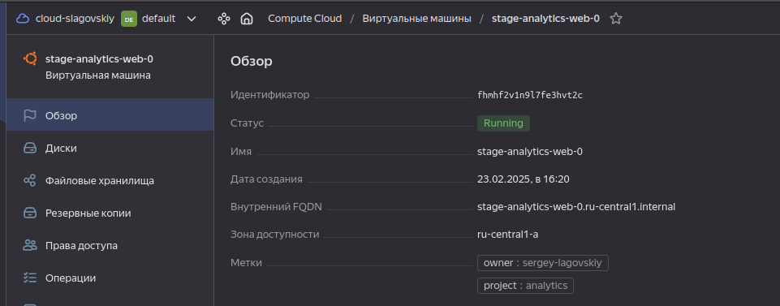
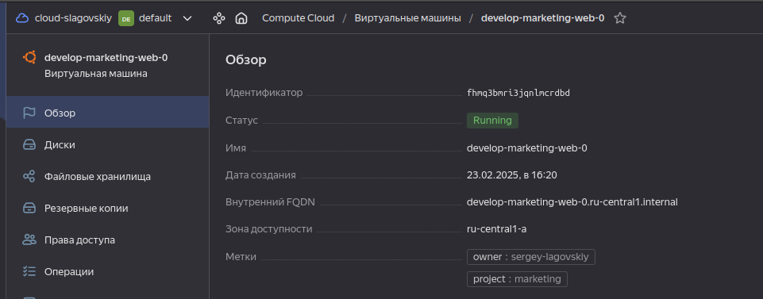

# Домашнее задание к занятию «Продвинутые методы работы с Terraform»

------

### Задание 1

1. Возьмите из [демонстрации к лекции готовый код](https://github.com/netology-code/ter-homeworks/tree/main/04/demonstration1) для создания с помощью двух вызовов remote-модуля -> двух ВМ, относящихся к разным проектам(marketing и analytics) используйте labels для обозначения принадлежности.  В файле cloud-init.yml необходимо использовать переменную для ssh-ключа вместо хардкода. Передайте ssh-ключ в функцию template_file в блоке vars ={} .
Воспользуйтесь [**примером**](https://grantorchard.com/dynamic-cloudinit-content-with-terraform-file-templates/). Обратите внимание, что ssh-authorized-keys принимает в себя список, а не строку.
3. Добавьте в файл cloud-init.yml установку nginx.
4. Предоставьте скриншот подключения к консоли и вывод команды ```sudo nginx -t```, скриншот консоли ВМ yandex cloud с их метками. Откройте terraform console и предоставьте скриншот содержимого модуля. Пример: > module.marketing_vm

```
Outputs:

out = [
  "develop-marketing-web-0.ru-central1.internal",
  "stage-analytics-web-0.ru-central1.internal",
]

$ terraform console

> module.marketing-vm
{
  "external_ip_address" = [
    "130.193.38.67",
  ]
  "fqdn" = [
    "develop-marketing-web-0.ru-central1.internal",
  ]
  "internal_ip_address" = [
    "10.0.1.9",
  ]
  "labels" = [
    tomap({
      "owner" = "sergey-lagovskiy"
      "project" = "marketing"
    }),
  ]
  "network_interface" = [
    tolist([
      {
        "dns_record" = tolist([])
        "index" = 0
        "ip_address" = "10.0.1.9"
        "ipv4" = true
        "ipv6" = false
        "ipv6_address" = ""
        "ipv6_dns_record" = tolist([])
        "mac_address" = "d0:0d:1a:1a:ed:b9"
        "nat" = true
        "nat_dns_record" = tolist([])
        "nat_ip_address" = "130.193.38.67"
        "nat_ip_version" = "IPV4"
        "security_group_ids" = toset([])
        "subnet_id" = "e9b8uj3fb5seagu1412u"
      },
    ]),
  ]
}

> module.analytics-vm
{
  "external_ip_address" = [
    "130.193.38.143",
  ]
  "fqdn" = [
    "stage-analytics-web-0.ru-central1.internal",
  ]
  "internal_ip_address" = [
    "10.0.1.29",
  ]
  "labels" = [
    tomap({
      "owner" = "sergey-lagovskiy"
      "project" = "analytics"
    }),
  ]
  "network_interface" = [
    tolist([
      {
        "dns_record" = tolist([])
        "index" = 0
        "ip_address" = "10.0.1.29"
        "ipv4" = true
        "ipv6" = false
        "ipv6_address" = ""
        "ipv6_dns_record" = tolist([])
        "mac_address" = "d0:0d:11:78:be:1b"
        "nat" = true
        "nat_dns_record" = tolist([])
        "nat_ip_address" = "130.193.38.143"
        "nat_ip_version" = "IPV4"
        "security_group_ids" = toset([])
        "subnet_id" = "e9b8uj3fb5seagu1412u"
      },
    ]),
  ]
}
```





```
$ ssh ubuntu@130.193.38.143

ubuntu@stage-analytics-web-0:~$ sudo nginx -t

nginx: the configuration file /etc/nginx/nginx.conf syntax is ok
nginx: configuration file /etc/nginx/nginx.conf test is successful

ubuntu@stage-analytics-web-0:~$ exit

logout

$ ssh ubuntu@130.193.38.67

ubuntu@develop-marketing-web-0:~$ sudo nginx -t
nginx: the configuration file /etc/nginx/nginx.conf syntax is ok
nginx: configuration file /etc/nginx/nginx.conf test is successful

ubuntu@develop-marketing-web-0:~$ exit

logout
```

------

### Задание 2

1. Напишите локальный модуль vpc, который будет создавать 2 ресурса: **одну** сеть и **одну** подсеть в зоне, объявленной при вызове модуля, например: ```ru-central1-a```.
2. Вы должны передать в модуль переменные с названием сети, zone и v4_cidr_blocks.
3. Модуль должен возвращать в root module с помощью output информацию о yandex_vpc_subnet. Пришлите скриншот информации из terraform console о своем модуле. Пример: > module.vpc_dev  
4. Замените ресурсы yandex_vpc_network и yandex_vpc_subnet созданным модулем. Не забудьте передать необходимые параметры сети из модуля vpc в модуль с виртуальной машиной.
5. Сгенерируйте документацию к модулю с помощью terraform-docs.
 
```
$ terraform console
> module.vpc
{
  "out_network" = {
    "created_at" = "2025-02-23T09:20:44Z"
    "default_security_group_id" = "enpkve0qmg3fd8bddq7t"
    "description" = ""
    "folder_id" = "b1gghlg0i9r4su8up17l"
    "id" = "enpsjnh9p5791r3ef12t"
    "labels" = tomap({})
    "name" = "develop"
    "subnet_ids" = tolist([])
    "timeouts" = null /* object */
  }
  "out_subnet" = {
    "created_at" = "2025-02-23T09:20:46Z"
    "description" = ""
    "dhcp_options" = tolist([])
    "folder_id" = "b1gghlg0i9r4su8up17l"
    "id" = "e9b8uj3fb5seagu1412u"
    "labels" = tomap({})
    "name" = "develop-subnet"
    "network_id" = "enpsjnh9p5791r3ef12t"
    "route_table_id" = ""
    "timeouts" = null /* object */
    "v4_cidr_blocks" = tolist([
      "10.0.1.0/24",
    ])
    "v6_cidr_blocks" = tolist([])
    "zone" = "ru-central1-a"
  }
}
```
terraform-docs:

## Requirements

| Name                                                                      | Version |
| ------------------------------------------------------------------------- | ------- |
| <a name="requirement_terraform"></a> [terraform](#requirement\_terraform) | >=1.8.4 |

## Providers

| Name                                                       | Version |
| ---------------------------------------------------------- | ------- |
| <a name="provider_yandex"></a> [yandex](#provider\_yandex) | n/a     |

## Modules

No modules.

## Resources

| Name                                                                                                                        | Type     |
| --------------------------------------------------------------------------------------------------------------------------- | -------- |
| [yandex_vpc_network.network](https://registry.terraform.io/providers/yandex-cloud/yandex/latest/docs/resources/vpc_network) | resource |
| [yandex_vpc_subnet.subnet](https://registry.terraform.io/providers/yandex-cloud/yandex/latest/docs/resources/vpc_subnet)    | resource |

## Inputs

| Name                                                                             | Description                                            | Type           | Default                                | Required |
| -------------------------------------------------------------------------------- | ------------------------------------------------------ | -------------- | -------------------------------------- | :------: |
| <a name="input_network_name"></a> [network\_name](#input\_network\_name)         | The name of the VPC network                            | `string`       | `"network"`                            |    no    |
| <a name="input_subnet_name"></a> [subnet\_name](#input\_subnet\_name)            | The name of the VPC subnet                             | `string`       | `"subnetwork"`                         |    no    |
| <a name="input_v4_cidr_blocks"></a> [v4\_cidr\_blocks](#input\_v4\_cidr\_blocks) | IPv4 CIDR blocks for the subnet                        | `list(string)` | <pre>[<br/>  "10.0.1.0/24"<br/>]</pre> |    no    |
| <a name="input_zone"></a> [zone](#input\_zone)                                   | The availability zone where the subnet will be created | `string`       | `"ru-central1-a"`                      |    no    |

## Outputs

| Name                                                                    | Description            |
| ----------------------------------------------------------------------- | ---------------------- |
| <a name="output_out_network"></a> [out\_network](#output\_out\_network) | Network information    |
| <a name="output_out_subnet"></a> [out\_subnet](#output\_out\_subnet)    | Subnetwork information |

------

### Задание 3
1. Выведите список ресурсов в стейте.
2. Полностью удалите из стейта модуль vpc.
3. Полностью удалите из стейта модуль vm.
4. Импортируйте всё обратно. Проверьте terraform plan. Значимых(!!) изменений быть не должно.
Приложите список выполненных команд и скриншоты процессы.

```
$ terraform state list

data.template_file.cloudinit
module.analytics-vm.data.yandex_compute_image.my_image
module.analytics-vm.yandex_compute_instance.vm[0]
module.marketing-vm.data.yandex_compute_image.my_image
module.marketing-vm.yandex_compute_instance.vm[0]
module.vpc.yandex_vpc_network.network
module.vpc.yandex_vpc_subnet.subnet


$ terraform state rm module.vpc

Removed module.vpc.yandex_vpc_network.network
Removed module.vpc.yandex_vpc_subnet.subnet
Successfully removed 2 resource instance(s).


$ terraform state rm module.analytics-vm

Removed module.analytics-vm.data.yandex_compute_image.my_image
Removed module.analytics-vm.yandex_compute_instance.vm[0]
Successfully removed 2 resource instance(s).


$ terraform state rm module.marketing-vm

Removed module.marketing-vm.data.yandex_compute_image.my_image
Removed module.marketing-vm.yandex_compute_instance.vm[0]
Successfully removed 2 resource instance(s).


$ terraform state list

data.template_file.cloudinit


$ terraform import module.vpc.yandex_vpc_network.network enpsjnh9p5791r3ef12t

data.template_file.cloudinit: Reading...
data.template_file.cloudinit: Read complete after 0s [id=4f860db2534ca53ea835c8dfa75235e9d87eec20ab346608b3aa3f851dec9d1c]
module.vpc.yandex_vpc_network.network: Importing from ID "enpsjnh9p5791r3ef12t"...
module.marketing-vm.data.yandex_compute_image.my_image: Reading...
module.analytics-vm.data.yandex_compute_image.my_image: Reading...
module.vpc.yandex_vpc_network.network: Import prepared!
  Prepared yandex_vpc_network for import
module.vpc.yandex_vpc_network.network: Refreshing state... [id=enpsjnh9p5791r3ef12t]
module.marketing-vm.data.yandex_compute_image.my_image: Read complete after 1s [id=fd84f596tp5sv9tjvmc0]
module.analytics-vm.data.yandex_compute_image.my_image: Read complete after 1s [id=fd84f596tp5sv9tjvmc0]

Import successful!

The resources that were imported are shown above. These resources are now in
your Terraform state and will henceforth be managed by Terraform.


$ terraform import module.vpc.yandex_vpc_subnet.subnet e9b8uj3fb5seagu1412u

data.template_file.cloudinit: Reading...
data.template_file.cloudinit: Read complete after 0s [id=4f860db2534ca53ea835c8dfa75235e9d87eec20ab346608b3aa3f851dec9d1c]
module.analytics-vm.data.yandex_compute_image.my_image: Reading...
module.marketing-vm.data.yandex_compute_image.my_image: Reading...
module.vpc.yandex_vpc_subnet.subnet: Importing from ID "e9b8uj3fb5seagu1412u"...
module.vpc.yandex_vpc_subnet.subnet: Import prepared!
  Prepared yandex_vpc_subnet for import
module.vpc.yandex_vpc_subnet.subnet: Refreshing state... [id=e9b8uj3fb5seagu1412u]
module.analytics-vm.data.yandex_compute_image.my_image: Read complete after 0s [id=fd84f596tp5sv9tjvmc0]
module.marketing-vm.data.yandex_compute_image.my_image: Read complete after 0s [id=fd84f596tp5sv9tjvmc0]

Import successful!

The resources that were imported are shown above. These resources are now in
your Terraform state and will henceforth be managed by Terraform.


$ terraform import module.analytics-vm.yandex_compute_instance.vm[0] fhmhf2v1n9l7fe3hvt2c

data.template_file.cloudinit: Reading...
data.template_file.cloudinit: Read complete after 0s [id=4f860db2534ca53ea835c8dfa75235e9d87eec20ab346608b3aa3f851dec9d1c]
module.marketing-vm.data.yandex_compute_image.my_image: Reading...
module.analytics-vm.data.yandex_compute_image.my_image: Reading...
module.analytics-vm.data.yandex_compute_image.my_image: Read complete after 0s [id=fd84f596tp5sv9tjvmc0]
module.marketing-vm.data.yandex_compute_image.my_image: Read complete after 0s [id=fd84f596tp5sv9tjvmc0]
module.analytics-vm.yandex_compute_instance.vm[0]: Importing from ID "fhmhf2v1n9l7fe3hvt2c"...
module.analytics-vm.yandex_compute_instance.vm[0]: Import prepared!
  Prepared yandex_compute_instance for import
module.analytics-vm.yandex_compute_instance.vm[0]: Refreshing state... [id=fhmhf2v1n9l7fe3hvt2c]

Import successful!

The resources that were imported are shown above. These resources are now in
your Terraform state and will henceforth be managed by Terraform.


$ terraform import module.marketing-vm.yandex_compute_instance.vm[0] fhmq3bmri3jqnlmcrdbd

data.template_file.cloudinit: Reading...
data.template_file.cloudinit: Read complete after 0s [id=4f860db2534ca53ea835c8dfa75235e9d87eec20ab346608b3aa3f851dec9d1c]
module.analytics-vm.data.yandex_compute_image.my_image: Reading...
module.marketing-vm.data.yandex_compute_image.my_image: Reading...
module.analytics-vm.data.yandex_compute_image.my_image: Read complete after 0s [id=fd84f596tp5sv9tjvmc0]
module.marketing-vm.data.yandex_compute_image.my_image: Read complete after 0s [id=fd84f596tp5sv9tjvmc0]
module.marketing-vm.yandex_compute_instance.vm[0]: Importing from ID "fhmq3bmri3jqnlmcrdbd"...
module.marketing-vm.yandex_compute_instance.vm[0]: Import prepared!
  Prepared yandex_compute_instance for import
module.marketing-vm.yandex_compute_instance.vm[0]: Refreshing state... [id=fhmq3bmri3jqnlmcrdbd]

Import successful!

The resources that were imported are shown above. These resources are now in
your Terraform state and will henceforth be managed by Terraform.


$ terraform state list

data.template_file.cloudinit
module.analytics-vm.data.yandex_compute_image.my_image
module.analytics-vm.yandex_compute_instance.vm[0]
module.marketing-vm.data.yandex_compute_image.my_image
module.marketing-vm.yandex_compute_instance.vm[0]
module.vpc.yandex_vpc_network.network
module.vpc.yandex_vpc_subnet.subnet


$ terraform plan

data.template_file.cloudinit: Reading...
data.template_file.cloudinit: Read complete after 0s [id=4f860db2534ca53ea835c8dfa75235e9d87eec20ab346608b3aa3f851dec9d1c]
module.marketing-vm.data.yandex_compute_image.my_image: Reading...
module.vpc.yandex_vpc_network.network: Refreshing state... [id=enpsjnh9p5791r3ef12t]
module.analytics-vm.data.yandex_compute_image.my_image: Reading...
module.marketing-vm.data.yandex_compute_image.my_image: Read complete after 0s [id=fd84f596tp5sv9tjvmc0]
module.analytics-vm.data.yandex_compute_image.my_image: Read complete after 0s [id=fd84f596tp5sv9tjvmc0]
module.vpc.yandex_vpc_subnet.subnet: Refreshing state... [id=e9b8uj3fb5seagu1412u]
module.marketing-vm.yandex_compute_instance.vm[0]: Refreshing state... [id=fhmq3bmri3jqnlmcrdbd]
module.analytics-vm.yandex_compute_instance.vm[0]: Refreshing state... [id=fhmhf2v1n9l7fe3hvt2c]

Terraform used the selected providers to generate the following execution plan. Resource actions are indicated with the following symbols:
  ~ update in-place

Terraform will perform the following actions:

  # module.analytics-vm.yandex_compute_instance.vm[0] will be updated in-place
  ~ resource "yandex_compute_instance" "vm" {
      + allow_stopping_for_update = true
        id                        = "fhmhf2v1n9l7fe3hvt2c"
        name                      = "stage-analytics-web-0"
        # (15 unchanged attributes hidden)

        # (6 unchanged blocks hidden)
    }

  # module.marketing-vm.yandex_compute_instance.vm[0] will be updated in-place
  ~ resource "yandex_compute_instance" "vm" {
      + allow_stopping_for_update = true
        id                        = "fhmq3bmri3jqnlmcrdbd"
        name                      = "develop-marketing-web-0"
        # (15 unchanged attributes hidden)

        # (6 unchanged blocks hidden)
    }

Plan: 0 to add, 2 to change, 0 to destroy.


$ terraform apply

data.template_file.cloudinit: Reading...
data.template_file.cloudinit: Read complete after 0s [id=4f860db2534ca53ea835c8dfa75235e9d87eec20ab346608b3aa3f851dec9d1c]
module.analytics-vm.data.yandex_compute_image.my_image: Reading...
module.vpc.yandex_vpc_network.network: Refreshing state... [id=enpsjnh9p5791r3ef12t]
module.marketing-vm.data.yandex_compute_image.my_image: Reading...
module.analytics-vm.data.yandex_compute_image.my_image: Read complete after 0s [id=fd84f596tp5sv9tjvmc0]
module.marketing-vm.data.yandex_compute_image.my_image: Read complete after 0s [id=fd84f596tp5sv9tjvmc0]
module.vpc.yandex_vpc_subnet.subnet: Refreshing state... [id=e9b8uj3fb5seagu1412u]
module.analytics-vm.yandex_compute_instance.vm[0]: Refreshing state... [id=fhmhf2v1n9l7fe3hvt2c]
module.marketing-vm.yandex_compute_instance.vm[0]: Refreshing state... [id=fhmq3bmri3jqnlmcrdbd]

Terraform used the selected providers to generate the following execution plan. Resource actions are indicated with the following symbols:
  ~ update in-place

Terraform will perform the following actions:

  # module.analytics-vm.yandex_compute_instance.vm[0] will be updated in-place
  ~ resource "yandex_compute_instance" "vm" {
      + allow_stopping_for_update = true
        id                        = "fhmhf2v1n9l7fe3hvt2c"
        name                      = "stage-analytics-web-0"
        # (15 unchanged attributes hidden)

        # (6 unchanged blocks hidden)
    }

  # module.marketing-vm.yandex_compute_instance.vm[0] will be updated in-place
  ~ resource "yandex_compute_instance" "vm" {
      + allow_stopping_for_update = true
        id                        = "fhmq3bmri3jqnlmcrdbd"
        name                      = "develop-marketing-web-0"
        # (15 unchanged attributes hidden)

        # (6 unchanged blocks hidden)
    }

Plan: 0 to add, 2 to change, 0 to destroy.

Do you want to perform these actions?
  Terraform will perform the actions described above.
  Only 'yes' will be accepted to approve.

  Enter a value: yes

module.analytics-vm.yandex_compute_instance.vm[0]: Modifying... [id=fhmhf2v1n9l7fe3hvt2c]
module.marketing-vm.yandex_compute_instance.vm[0]: Modifying... [id=fhmq3bmri3jqnlmcrdbd]
module.analytics-vm.yandex_compute_instance.vm[0]: Modifications complete after 0s [id=fhmhf2v1n9l7fe3hvt2c]
module.marketing-vm.yandex_compute_instance.vm[0]: Modifications complete after 0s [id=fhmq3bmri3jqnlmcrdbd]

Apply complete! Resources: 0 added, 2 changed, 0 destroyed.

Outputs:

out = [
  "develop-marketing-web-0.ru-central1.internal",
  "stage-analytics-web-0.ru-central1.internal",
]
```