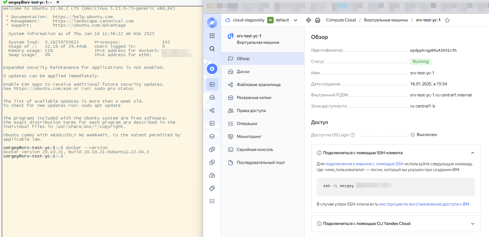

# Домашнее задание к занятию 1.  «Введение в виртуализацию»

#### Это задание для самостоятельной отработки навыков и не предполагает обратной связи от преподавателя. Его выполнение не влияет на завершение модуля. Но мы рекомендуем его выполнить, чтобы закрепить полученные знания.  Все вопросы, возникающие в процессе выполнения заданий, пишите в учебный чат или в раздел "Вопросы по заданиям" в личном кабинете.

### Цели задания
1. Научиться запускать виртуальную машину в Yandex Cloud с минимальным расходом ресурсов.
2. Попрактиковаться в выборе платформы  и системы управления виртуализации для решения требуемых задач.

### Инструкция к выполению

1. Для выполнения задачи 1 ознакомьтесь с [инструкцией](https://github.com/netology-code/devops-materials/blob/master/cloudwork.MD) по экономии облачных ресурсов и затем выполните задачу 1 по шагам.
2. Своё решение к задачам 2,3,4 загрузите  в ваш ЛК.
   
## Задача 1

Ознакомьтесь с [инструкцией ](https://github.com/netology-code/devops-materials/blob/master/cloudwork.MD) по экономии облачных ресурсов.


1. Создайте через web-интерфейс Yandex Cloud - VPC и виртуальную машину из инструкции конфигурации "эконом-ВМ" с публичным ip-адресом. В пункте "Выбор образа/загрузочного диска" выберите вкладку "Cloud Marketplace" , щелкните "Посмотреть больше", найдите образ "Yandex Cloud Toolbox".
2. Убедитесь, что вы можете подключиться к консоли ВМ через ssh, используя публичный ip-адрес. Убедитесь, что на ВМ установлен Docker с помощью команды ```docker --version```(команду выполните от имени root пользователя) !
3. Узнайте в инструкции Яндекс, какие еще инструменты предустановлены в данном образе.
4. Оставьте ВМ работать, пока она не выключится самостоятельно! Опция "прерываемая" выключит ее не позже чем через 24 часа. 
5. Для наглядности подождите еще 1 сутки.
6. Перейдите по [ссылке ](https://console.cloud.yandex.ru/billing?section=accounts). Выберите свой платежный аккаунт. Перейдите на вкладку детализация (фильтр "По продуктам") и оцените график потребления финансов.
7. Удалите ВМ или пользуйтесь ею при выполнении последующих домашних заданий курса обучения.

---

## Задача 1 - Решение



---


## Задача 2

Выберите один из вариантов платформы в зависимости от задачи. Здесь нет однозначно верного ответа так как все зависит от конкретных условий: финансирование, компетенции специалистов, удобство использования, надежность, требования ИБ и законодательства, фазы луны.

Тип платформы:

- физические сервера;
- паравиртуализация;
- виртуализация уровня ОС;

Задачи:

- высоконагруженная база данных MySql, критичная к отказу;
- различные web-приложения;
- Windows-системы для использования бухгалтерским отделом;
- системы, выполняющие высокопроизводительные расчёты на GPU.

Объясните критерии выбора платформы в каждом случае.

---

## Задача 2 - Решение

1. Высоконагруженная база данных MySQL, критическая к отказу

    Здесь критичны производительность, отказоустойчивость и масштабируемость.  Доступность данных должна быть максимально высокой.

    **Физические сервера** в кластере с использованием высокоскоростных сетевых соединений (например, Infiniband) и отказоустойчивого хранилища данных (SAN/NAS с RAID).  Виртуализация здесь может добавить избыточную задержку и усложнить управление в случае критических ситуаций.

2. Различные web-приложения

    Гибкость, масштабируемость, простота управления и относительно низкая стоимость.

    **Виртуализация уровня ОС** или **паравиртуализация**.  Это позволяет легко масштабировать ресурсы, быстро развертывать новые приложения и эффективно использовать аппаратные ресурсы.

3. Windows-системы для использования бухгалтерским отделом

    Простота управления, совместимость с бухгалтерским ПО, безопасность и достаточная производительность.

    **Виртуализация уровня ОС**.  Это позволяет легко создавать резервные копии, управлять доступом и изолировать рабочие среды.

4. Системы, выполняющие высокопроизводительные расчёты на GPU:

    Максимальная производительность GPU, низкая задержка доступа к памяти и возможность эффективного использования ресурсов GPU.

    **Физические сервера** с мощными GPU и высокоскоростной памятью.  Если виртуализация необходима, то следует использовать специализированные решения для виртуализации GPU с поддержкой технологии SR-IOV (Single Root I/O Virtualization).

---

## Задача 3

Выберите подходящую систему управления виртуализацией для предложенного сценария. Опишите ваш выбор.

Сценарии:

1. 100 виртуальных машин на базе Linux и Windows, общие задачи, нет особых требований. Преимущественно Windows based-инфраструктура, требуется реализация программных балансировщиков нагрузки, репликации данных и автоматизированного механизма создания резервных копий.
2. Требуется наиболее производительное бесплатное open source-решение для виртуализации небольшой (20-30 серверов) инфраструктуры на базе Linux и Windows виртуальных машин.
3. Необходимо бесплатное, максимально совместимое и производительное решение для виртуализации Windows-инфраструктуры.
4. Необходимо рабочее окружение для тестирования программного продукта на нескольких дистрибутивах Linux.


---

## Задача 3 - Решение

1. 100 виртуальных машин (Linux/Windows), общие задачи, Windows-инфраструктура, балансировка нагрузки, репликация, резервное копирование.

    *VMware vSphere или Proxmox VE.*

    Для такого масштаба (100 ВМ) нужна система с хорошими возможностями управления, мониторинга и автоматизации. VMware vSphere — промышленный стандарт,  обеспечивающий все необходимые функции. Proxmox VE —  бесплатная альтернатива с открытым исходным кодом,  предлагающая  многие из тех же возможностей.  Выбор зависит от бюджета.

2. Наиболее производительное бесплатное open source-решение для 20-30 серверов (Linux/Windows).

    *KVM + oVirt или Cockpit.*

    KVM — это высокопроизводительный гипервизор на уровне ядра Linux.  Он очень эффективен с точки зрения использования ресурсов.

3. Бесплатное, максимально совместимое и производительное решение для виртуализации Windows-инфраструктуры.

    *Hyper-V.*

    Hyper-V —  встроенный гипервизор в Windows Server, обеспечивающий отличную совместимость с Windows-приложениями и хорошую производительность. Он бесплатен, если используется с лицензией Windows Server.

4. Рабочее окружение для тестирования программного продукта на нескольких дистрибутивах Linux.

    *VirtualBox, VMWare Workstation*

    VirtualBox —  простой в использовании и кроссплатформенный гипервизор. Он бесплатен для личного и некоммерческого использования.
    
    VMWare Workstation - Более мощная альтернатива VirtualBox, в настоящее время так же стал бесплатным.

---

## Задача 4

Опишите возможные проблемы и недостатки гетерогенной среды виртуализации (использования нескольких систем управления виртуализацией одновременно) и что необходимо сделать для минимизации этих рисков и проблем. Если бы у вас был выбор, создавали бы вы гетерогенную среду или нет?

---

Задача 4 - Решение

**Недостатки**

* Сложность управления: Управление несколькими платформами виртуализации требует больше времени и ресурсов.  Отсутствует единая точка управления, мониторинга и администрирования.  Это усложняет задачи резервного копирования, миграции и масштабирования.

* Отсутствие унификации:  Невозможность использовать единые инструменты и политики для всех виртуальных машин.

* Проблемы с совместимостью:  Не все инструменты и технологии совместимы со всеми платформами виртуализации.

* Увеличение затрат:  Использование нескольких платформ виртуализации может привести к увеличению затрат на лицензирование, обучение персонала и поддержку.

* Усложнение устранения неполадок:  Диагностика и устранение неполадок в гетерогенной среде может быть сложнее, чем в однородной.


**Минимизация рисков и проблем:**

* Четкое планирование:  Перед развертыванием гетерогенной среды необходимо тщательно спланировать архитектуру, определить роли каждой платформы виртуализации и разработать стратегию управления.

* Использование инструментов управления:  Использование инструментов управления, которые поддерживают несколько платформ виртуализации, может помочь упростить администрирование и мониторинг.

* Стандартизация:  Необходимо установить стандарты для настройки виртуальных машин, безопасности и управления.

* Автоматизация:  Автоматизация задач, таких как резервное копирование, миграция и развертывание.


**Личный выбор:**

Если бы у меня был выбор, я бы **не создавал** гетерогенную среду виртуализации, если только это не было бы абсолютно необходимо из-за специфических требований к определенному программному обеспечению или оборудованию, которое не поддерживается выбранной платформой.

---

### Правила приема

Домашнее задание выполните в файле readme.md в GitHub-репозитории. В личном кабинете отправьте на проверку ссылку на .md-файл в вашем репозитории.
