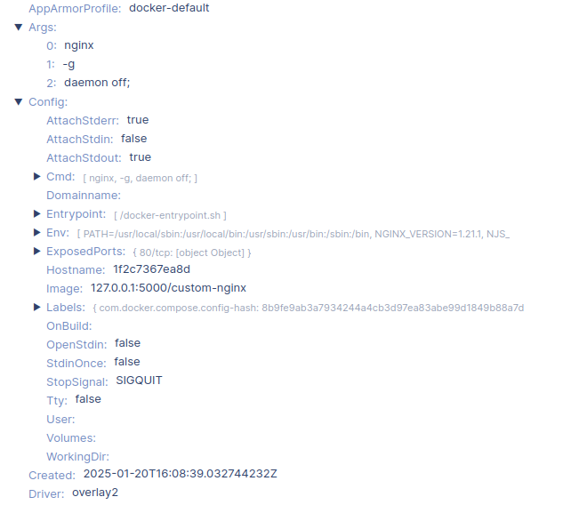

# Домашнее задание к занятию 4 «Оркестрация группой Docker контейнеров на примере Docker Compose»

## Задача 1

Сценарий выполнения задачи:
- Установите docker и docker compose plugin на свою linux рабочую станцию или ВМ.
- Если dockerhub недоступен создайте файл /etc/docker/daemon.json с содержимым: ```{"registry-mirrors": ["https://mirror.gcr.io", "https://daocloud.io", "https://c.163.com/", "https://registry.docker-cn.com"]}```
- Зарегистрируйтесь и создайте публичный репозиторий  с именем "custom-nginx" на https://hub.docker.com (ТОЛЬКО ЕСЛИ У ВАС ЕСТЬ ДОСТУП);
- скачайте образ nginx:1.21.1;
- Создайте Dockerfile и реализуйте в нем замену дефолтной индекс-страницы(/usr/share/nginx/html/index.html), на файл index.html с содержимым:
```
<html>
<head>
Hey, Netology
</head>
<body>
<h1>I will be DevOps Engineer!</h1>
</body>
</html>
```
- Соберите и отправьте созданный образ в свой dockerhub-репозитории c tag 1.0.0 (ТОЛЬКО ЕСЛИ ЕСТЬ ДОСТУП). 
- Предоставьте ответ в виде ссылки на https://hub.docker.com/<username_repo>/custom-nginx/general .

---
## Решение 1

```
sergey@netology-vm-01:~/Work/netology-devops/virtualization/Docker intro/task 1$ docker build --tag nginx:1.0.0 .

[+] Building 1.8s (7/7) FINISHED                                                                                             docker:default
 => [internal] load build definition from Dockerfile                                                                                   0.0s
 => => transferring dockerfile: 103B                                                                                                   0.0s
 => [internal] load metadata for docker.io/library/nginx:1.21.1                                                                        1.7s
 => [internal] load .dockerignore                                                                                                      0.0s
 => => transferring context: 2B                                                                                                        0.0s
 => [internal] load build context                                                                                                      0.0s
 => => transferring context: 31B                                                                                                       0.0s
 => [1/2] FROM docker.io/library/nginx:1.21.1@sha256:a05b0cdd4fc1be3b224ba9662ebdf98fe44c09c0c9215b45f84344c12867002e                  0.0s
 => CACHED [2/2] COPY index.html /usr/share/nginx/html/index.html                                                                      0.0s
 => exporting to image                                                                                                                 0.0s
 => => exporting layers                                                                                                                0.0s
 => => writing image sha256:23e3c056930fee226728e99bb8296e27839bcde23712e377b5d4cd224900888c                                           0.0s
 => => naming to docker.io/library/nginx:1.0.0                                                                                         0.0s

 ```

```
sergey@netology-vm-01:~/Work/netology-devops/virtualization/Docker intro/task 1$ docker image ls

REPOSITORY   TAG       IMAGE ID       CREATED         SIZE
nginx        1.0.0     23e3c056930f   6 minutes ago   133MB
```

```
sergey@netology-vm-01:~/Work/netology-devops/virtualization/Docker intro/task 1$ docker run --rm -d --name test -p 80:80 nginx:1.0.0

59413c0073240cd9c18a80446060b0f277d007c559cc942d06edeb5778dc680a

sergey@netology-vm-01:~/Work/netology-devops/virtualization/Docker intro/task 1$ curl localhost
<html>
<head>
Hey, Netology
</head>
<body>
<h1>I will be DevOps Engineer!</h1>
</body>
</html>sergey@netology-vm-01:~$ ```


sergey@netology-vm-01:~/Work/netology-devops/virtualization/Docker intro/task 1$ docker stop test
test
```

push to hub.docker.com

```
sergey@netology-vm-01:~/Work/netology-devops/virtualization/Docker intro/task 1$ docker login --username slagovskiy

Password: 
WARNING! Your password will be stored unencrypted in /home/sergey/.docker/config.json.
Configure a credential helper to remove this warning. See
https://docs.docker.com/engine/reference/commandline/login/#credential-stores

Login Succeeded


sergey@netology-vm-01:~/Work/netology-devops/virtualization/Docker intro/task 1$ docker push slagovskiy/nginx:1.0.0

The push refers to repository [docker.io/slagovskiy/nginx]
fed03a556540: Pushed 
d47e4d19ddec: Mounted from library/nginx 
8e58314e4a4f: Mounted from library/nginx 
ed94af62a494: Mounted from library/nginx 
875b5b50454b: Mounted from library/nginx 
63b5f2c0d071: Mounted from library/nginx 
d000633a5681: Mounted from library/nginx 
1.0.0: digest: sha256:275a5928a1c50fad16055306f666f8be94022ae9822229d1ffb40fc2da82d27a size: 1777
```

link -> 

---


## Задача 2
1. Запустите ваш образ custom-nginx:1.0.0 командой docker run в соответвии с требованиями:
- имя контейнера "ФИО-custom-nginx-t2"
- контейнер работает в фоне
- контейнер опубликован на порту хост системы 127.0.0.1:8080
2. Не удаляя, переименуйте контейнер в "custom-nginx-t2"
3. Выполните команду ```date +"%d-%m-%Y %T.%N %Z" ; sleep 0.150 ; docker ps ; ss -tlpn | grep 127.0.0.1:8080  ; docker logs custom-nginx-t2 -n1 ; docker exec -it custom-nginx-t2 base64 /usr/share/nginx/html/index.html```
4. Убедитесь с помощью curl или веб браузера, что индекс-страница доступна.

В качестве ответа приложите скриншоты консоли, где видно все введенные команды и их вывод.


---

## Решение 2

### 1
```
$ docker run -d --name LagovskiySergeyV-custom-nginx-t2 -p 8080:80 nginx:1.0.0

09e66473b1f919cb45957b347076cecb42aa91c2e516d1d015eff3313efad9d1


$ docker ps

CONTAINER ID   IMAGE         COMMAND                  CREATED          STATUS          PORTS                                     NAMES
09e66473b1f9   nginx:1.0.0   "/docker-entrypoint.…"   26 seconds ago   Up 25 seconds   0.0.0.0:8080->80/tcp, [::]:8080->80/tcp   LagovskiySergeyV-custom-nginx-t2


$ curl localhost:8080
<html>
<head>
Hey, Netology
</head>
<body>
<h1>I will be DevOps Engineer!</h1>
</body>
</html>
```

### 2

```
$ docker ps

CONTAINER ID   IMAGE         COMMAND                  CREATED         STATUS         PORTS                                     NAMES
09e66473b1f9   nginx:1.0.0   "/docker-entrypoint.…"   2 minutes ago   Up 2 minutes   0.0.0.0:8080->80/tcp, [::]:8000->80/tcp   custom-nginx-t2
```

### 3

```
$ date +"%d-%m-%Y %T.%N %Z" ; sleep 0.150 ; docker ps ; ss -tlpn | grep 127.0.0.1:8080  ; docker logs custom-nginx-t2 -n1 ; docker exec -it custom-nginx-t2 base64 /usr/share/nginx/html/index.html

19-01-2025 22:13:03.280749217 +07
CONTAINER ID   IMAGE         COMMAND                  CREATED          STATUS          PORTS                                     NAMES
a645bc0aa38f   nginx:1.0.0   "/docker-entrypoint.…"   42 seconds ago   Up 41 seconds   0.0.0.0:8080->80/tcp, [::]:8080->80/tcp   custom-nginx-t2
2025/01/19 15:12:21 [notice] 1#1: start worker process 34
PGh0bWw+CjxoZWFkPgpIZXksIE5ldG9sb2d5CjwvaGVhZD4KPGJvZHk+CjxoMT5JIHdpbGwgYmUg
RGV2T3BzIEVuZ2luZWVyITwvaDE+CjwvYm9keT4KPC9odG1sPg==
```

### 4

```
$ curl localhost:8080
<html>
<head>
Hey, Netology
</head>
<body>
<h1>I will be DevOps Engineer!</h1>
</body>
</html>
```

---


## Задача 3
1. Воспользуйтесь docker help или google, чтобы узнать как подключиться к стандартному потоку ввода/вывода/ошибок контейнера "custom-nginx-t2".
2. Подключитесь к контейнеру и нажмите комбинацию Ctrl-C.
3. Выполните ```docker ps -a``` и объясните своими словами почему контейнер остановился.
4. Перезапустите контейнер
5. Зайдите в интерактивный терминал контейнера "custom-nginx-t2" с оболочкой bash.
6. Установите любимый текстовый редактор(vim, nano итд) с помощью apt-get.
7. Отредактируйте файл "/etc/nginx/conf.d/default.conf", заменив порт "listen 80" на "listen 81".
8. Запомните(!) и выполните команду ```nginx -s reload```, а затем внутри контейнера ```curl http://127.0.0.1:80 ; curl http://127.0.0.1:81```.
9. Выйдите из контейнера, набрав в консоли  ```exit``` или Ctrl-D.
10. Проверьте вывод команд: ```ss -tlpn | grep 127.0.0.1:8080``` , ```docker port custom-nginx-t2```, ```curl http://127.0.0.1:8080```. Кратко объясните суть возникшей проблемы.
11. * Это дополнительное, необязательное задание. Попробуйте самостоятельно исправить конфигурацию контейнера, используя доступные источники в интернете. Не изменяйте конфигурацию nginx и не удаляйте контейнер. Останавливать контейнер можно. [пример источника](https://www.baeldung.com/linux/assign-port-docker-container)
12. Удалите запущенный контейнер "custom-nginx-t2", не останавливая его.(воспользуйтесь --help или google)

В качестве ответа приложите скриншоты консоли, где видно все введенные команды и их вывод.


---

## Решение 3


```
$ docker attach custom-nginx-t2 

172.17.0.1 - - [19/Jan/2025:15:15:57 +0000] "GET / HTTP/1.1" 200 94 "-" "Mozilla/5.0 (X11; Ubuntu; Linux x86_64; rv:134.0) Gecko/20100101 Firefox/134.0" "-"
2025/01/19 15:15:57 [error] 31#31: *1 open() "/usr/share/nginx/html/favicon.ico" failed (2: No such file or directory), client: 172.17.0.1, server: localhost, request: "GET /favicon.ico HTTP/1.1", host: "localhost:8080", referrer: "http://localhost:8080/"
172.17.0.1 - - [19/Jan/2025:15:15:57 +0000] "GET /favicon.ico HTTP/1.1" 404 153 "http://localhost:8080/" "Mozilla/5.0 (X11; Ubuntu; Linux x86_64; rv:134.0) Gecko/20100101 Firefox/134.0" "-"
^C2025/01/19 15:16:00 [notice] 1#1: signal 2 (SIGINT) received, exiting
2025/01/19 15:16:00 [notice] 31#31: exiting
2025/01/19 15:16:00 [notice] 32#32: exiting
2025/01/19 15:16:00 [notice] 34#34: exiting
2025/01/19 15:16:00 [notice] 33#33: exiting
2025/01/19 15:16:00 [notice] 32#32: exit
2025/01/19 15:16:00 [notice] 31#31: exit
2025/01/19 15:16:00 [notice] 34#34: exit
2025/01/19 15:16:00 [notice] 33#33: exit
2025/01/19 15:16:00 [notice] 1#1: signal 17 (SIGCHLD) received from 33
2025/01/19 15:16:00 [notice] 1#1: worker process 33 exited with code 0
2025/01/19 15:16:00 [notice] 1#1: signal 29 (SIGIO) received
2025/01/19 15:16:00 [notice] 1#1: signal 17 (SIGCHLD) received from 31
2025/01/19 15:16:00 [notice] 1#1: worker process 31 exited with code 0
2025/01/19 15:16:00 [notice] 1#1: signal 29 (SIGIO) received
2025/01/19 15:16:00 [notice] 1#1: signal 17 (SIGCHLD) received from 32
2025/01/19 15:16:00 [notice] 1#1: worker process 32 exited with code 0
2025/01/19 15:16:00 [notice] 1#1: signal 29 (SIGIO) received
2025/01/19 15:16:00 [notice] 1#1: signal 17 (SIGCHLD) received from 34
2025/01/19 15:16:00 [notice] 1#1: worker process 34 exited with code 0
2025/01/19 15:16:00 [notice] 1#1: exit


$ docker ps -a

CONTAINER ID   IMAGE         COMMAND                  CREATED         STATUS                      PORTS     NAMES
a645bc0aa38f   nginx:1.0.0   "/docker-entrypoint.…"   4 minutes ago   Exited (0) 38 seconds ago             custom-nginx-t2
```

Контейнер останавливается т.к. мы подключаемся к стандартному потоку т.е. мы видим результат работы endpoint-а контейнера, которым является nginx, а, послав в поток ctrl+c, мы посылаем nginx сигнал на остановку, endpoint перестал существовать - контейнер остановился.


```
$ docker start custom-nginx-t2 
custom-nginx-t2

$ docker exec -it custom-nginx-t2 bash

root@a645bc0aa38f:/# apt update      
Get:1 http://security.debian.org/debian-security buster/updates InRelease [34.8 kB]
Get:2 http://deb.debian.org/debian buster InRelease [122 kB]
Get:3 http://deb.debian.org/debian buster-updates InRelease [56.6 kB]
Get:4 http://deb.debian.org/debian buster/main amd64 Packages [7909 kB]
Get:5 http://security.debian.org/debian-security buster/updates/main amd64 Packages [610 kB]
Get:6 http://deb.debian.org/debian buster-updates/main amd64 Packages [8788 B]
Fetched 8741 kB in 3s (3454 kB/s)                         
Reading package lists... Done
Building dependency tree       
Reading state information... Done
56 packages can be upgraded. Run 'apt list --upgradable' to see them.

root@a645bc0aa38f:/# apt install nano
Reading package lists... Done
Building dependency tree       
Reading state information... Done
Suggested packages:
  spell
The following NEW packages will be installed:
  nano
0 upgraded, 1 newly installed, 0 to remove and 56 not upgraded.
Need to get 545 kB of archives.
After this operation, 2269 kB of additional disk space will be used.
Get:1 http://security.debian.org/debian-security buster/updates/main amd64 nano amd64 3.2-3+deb10u1 [545 kB]
Fetched 545 kB in 1s (824 kB/s)
debconf: delaying package configuration, since apt-utils is not installed
Selecting previously unselected package nano.
(Reading database ... 7638 files and directories currently installed.)
Preparing to unpack .../nano_3.2-3+deb10u1_amd64.deb ...
Unpacking nano (3.2-3+deb10u1) ...
Setting up nano (3.2-3+deb10u1) ...
update-alternatives: using /bin/nano to provide /usr/bin/editor (editor) in auto mode
update-alternatives: warning: skip creation of /usr/share/man/man1/editor.1.gz because associated file /usr/share/man/man1/nano.1.gz (of link group editor) doesn't exist
update-alternatives: using /bin/nano to provide /usr/bin/pico (pico) in auto mode
update-alternatives: warning: skip creation of /usr/share/man/man1/pico.1.gz because associated file /usr/share/man/man1/nano.1.gz (of link group pico) doesn't exist

```

```
root@a645bc0aa38f:/# nano /etc/nginx/conf.d/default.conf

root@a645bc0aa38f:/# cat /etc/nginx/conf.d/default.conf

server {
    listen       81;
    listen  [::]:81;
    server_name  localhost;

    #access_log  /var/log/nginx/host.access.log  main;

    location / {
        root   /usr/share/nginx/html;
        index  index.html index.htm;
    }

    #error_page  404              /404.html;

    # redirect server error pages to the static page /50x.html
    #
    error_page   500 502 503 504  /50x.html;
    location = /50x.html {
        root   /usr/share/nginx/html;
    }

    # proxy the PHP scripts to Apache listening on 127.0.0.1:80
    #
    #location ~ \.php$ {
    #    proxy_pass   http://127.0.0.1;
    #}

    # pass the PHP scripts to FastCGI server listening on 127.0.0.1:9000
    #
    #location ~ \.php$ {
    #    root           html;
    #    fastcgi_pass   127.0.0.1:9000;
    #    fastcgi_index  index.php;
    #    fastcgi_param  SCRIPT_FILENAME  /scripts$fastcgi_script_name;
    #    include        fastcgi_params;
    #}

    # deny access to .htaccess files, if Apache's document root
    # concurs with nginx's one
    #
    #location ~ /\.ht {
    #    deny  all;
    #}
}

root@a645bc0aa38f:/# nginx -s reload

2025/01/19 15:26:21 [notice] 319#319: signal process started


root@a645bc0aa38f:/# curl http://127.0.0.1:80 ; curl http://127.0.0.1:81

curl: (7) Failed to connect to 127.0.0.1 port 80: Connection refused

<html>
<head>
Hey, Netology
</head>
<body>
<h1>I will be DevOps Engineer!</h1>
</body>
</html>
```

```
$ ss -tlpn | grep 127.0.0.1:8080

$ docker port custom-nginx-t2
80/tcp -> 0.0.0.0:8080
80/tcp -> [::]:8080

$ curl http://127.0.0.1:8080
curl: (56) Recv failure: Connection reset by peer
```

Изначально nginx работал на 80 порту с параметром -p этот порт был проброшен на 8080 порт хоста, теперь nginx работает на 81 порту, следовательно порт не пробрасывает, что бы исправить ситуацию, не меняя конфигурацию nginx нужно остановить сервис docker и вручную исправить конфигурацию контейнера, которая находится в /var/lib/docker/containers/<CONTAINER_UUID>/config.v2.json. Исправлять надо опубликованный порт `"ExposedPorts":{"81/tcp":{}}` и проброс `"Ports":{"81/tcp":[{"HostIp":"0.0.0.0","HostPort":"8080"},{"HostIp":"::","HostPort":"8080"}]}`. А так же файл hostconfig.json, исправлять `"PortBindings":{"81/tcp":[{"HostIp":"","
HostPort":"8080"}]}`.

```
$ systemctl stop docker
Warning: Stopping docker.service, but it can still be activated by:
  docker.socket
```

Исправляем файлы config.v2.json и hostconfig.json.

```
$ systemctl start docker

$ docker start custom-nginx-t2
custom-nginx-t2

$ docker ps
CONTAINER ID   IMAGE         COMMAND                  CREATED          STATUS         PORTS                                     NAMES
a645bc0aa38f   nginx:1.0.0   "/docker-entrypoint.…"   54 minutes ago   Up 3 seconds   0.0.0.0:8080->81/tcp, [::]:8080->81/tcp   custom-nginx-t2

$ curl localhost:8080
<html>
<head>
Hey, Netology
</head>
<body>
<h1>I will be DevOps Engineer!</h1>
</body>
</html>
```

Решение такое себе, т.к. приходится полностью остановить службу, что повлечет остановку всех контейнеров.

---


## Задача 4


- Запустите первый контейнер из образа ***centos*** c любым тегом в фоновом режиме, подключив папку  текущий рабочий каталог ```$(pwd)``` на хостовой машине в ```/data``` контейнера, используя ключ -v.
- Запустите второй контейнер из образа ***debian*** в фоновом режиме, подключив текущий рабочий каталог ```$(pwd)``` в ```/data``` контейнера. 
- Подключитесь к первому контейнеру с помощью ```docker exec``` и создайте текстовый файл любого содержания в ```/data```.
- Добавьте ещё один файл в текущий каталог ```$(pwd)``` на хостовой машине.
- Подключитесь во второй контейнер и отобразите листинг и содержание файлов в ```/data``` контейнера.


В качестве ответа приложите скриншоты консоли, где видно все введенные команды и их вывод.

---

## Решение 4

Запуск контейнеров

```
sergey@netology-vm-01:~/Work/netology-devops/virtualization/Docker-intro/task-4$ docker run --name debian --rm -d -v $(pwd):/data debian tail -f /dev/null

fb61c3266d69591a8489b9a934c0ce9872eb4f8074b779d1c1b751fbb4f11f29


sergey@netology-vm-01:~/Work/netology-devops/virtualization/Docker-intro/task-4$ docker run --name centos --rm -d -v $(pwd):/data centos tail -f /dev/null

4bdaa4ca34d2f1bc52275c88107ee9c73cfd4ecb914481cff50d9ed8b7233ba6


sergey@netology-vm-01:~/Work/netology-devops/virtualization/Docker-intro/task-4$ docker ps

CONTAINER ID   IMAGE     COMMAND               CREATED          STATUS          PORTS     NAMES
4bdaa4ca34d2   centos    "tail -f /dev/null"   4 seconds ago    Up 3 seconds              centos
fb61c3266d69   debian    "tail -f /dev/null"   23 seconds ago   Up 22 seconds             debian
```

```
sergey@netology-vm-01:~/Work/netology-devops/virtualization/Docker-intro/task-4$ docker exec centos echo 123 > /data/123.txt
sergey@netology-vm-01:~/Work/netology-devops/virtualization/Docker-intro/task-4$ mkdir qwerty
sergey@netology-vm-01:~/Work/netology-devops/virtualization/Docker-intro/task-4$ docker exec debian ls /data
123.txt
qwerty
```


---


## Задача 5

1. Создайте отдельную директорию(например /tmp/netology/docker/task5) и 2 файла внутри него.
"compose.yaml" с содержимым:
```
version: "3"
services:
  portainer:
    network_mode: host
    image: portainer/portainer-ce:latest
    volumes:
      - /var/run/docker.sock:/var/run/docker.sock
```
"docker-compose.yaml" с содержимым:
```
version: "3"
services:
  registry:
    image: registry:2

    ports:
    - "5000:5000"
```

И выполните команду "docker compose up -d". Какой из файлов был запущен и почему? (подсказка: https://docs.docker.com/compose/compose-application-model/#the-compose-file )

2. Отредактируйте файл compose.yaml так, чтобы были запущенны оба файла. (подсказка: https://docs.docker.com/compose/compose-file/14-include/)

3. Выполните в консоли вашей хостовой ОС необходимые команды чтобы залить образ custom-nginx как custom-nginx:latest в запущенное вами, локальное registry. Дополнительная документация: https://distribution.github.io/distribution/about/deploying/
4. Откройте страницу "https://127.0.0.1:9000" и произведите начальную настройку portainer.(логин и пароль адмнистратора)
5. Откройте страницу "http://127.0.0.1:9000/#!/home", выберите ваше local  окружение. Перейдите на вкладку "stacks" и в "web editor" задеплойте следующий компоуз:

```
version: '3'

services:
  nginx:
    image: 127.0.0.1:5000/custom-nginx
    ports:
      - "9090:80"
```
6. Перейдите на страницу "http://127.0.0.1:9000/#!/2/docker/containers", выберите контейнер с nginx и нажмите на кнопку "inspect". В представлении <> Tree разверните поле "Config" и сделайте скриншот от поля "AppArmorProfile" до "Driver".

7. Удалите любой из манифестов компоуза(например compose.yaml).  Выполните команду "docker compose up -d". Прочитайте warning, объясните суть предупреждения и выполните предложенное действие. Погасите compose-проект ОДНОЙ(обязательно!!) командой.

В качестве ответа приложите скриншоты консоли, где видно все введенные команды и их вывод, файл compose.yaml , скриншот portainer c задеплоенным компоузом.

---

## Решение 5

```
$ ls -l
total 8
-rw-rw-r-- 1 sergey sergey 163 янв 20 22:42 compose.yaml
-rw-rw-r-- 1 sergey sergey  87 янв 20 22:42 docker-compose.yaml
```

```
$ docker compose up -d
WARN[0000] Found multiple config files with supported names: /home/sergey/Work/netology-devops/virtualization/Docker-intro/task-5/compose.yaml, /home/sergey/Work/netology-devops/virtualization/Docker-intro/task-5/docker-compose.yaml 
WARN[0000] Using /home/sergey/Work/netology-devops/virtualization/Docker-intro/task-5/compose.yaml 
WARN[0000] /home/sergey/Work/netology-devops/virtualization/Docker-intro/task-5/compose.yaml: the attribute `version` is obsolete, it will be ignored, please remove it to avoid potential confusion 
[+] Running 12/12
 ✔ portainer Pulled                                                                                               18.9s 
   ✔ dc8df0f2921e Pull complete                                                                                    1.4s 
   ✔ c82aa9c9fb45 Pull complete                                                                                    1.4s 
   ✔ d40df14c1d7a Pull complete                                                                                    4.0s 
   ✔ a3939f2dc487 Pull complete                                                                                   11.8s 
   ✔ 204b2fbb824e Pull complete                                                                                   12.2s 
   ✔ a53c840f28bf Pull complete                                                                                   12.9s 
   ✔ 9e1dadc4be73 Pull complete                                                                                   13.0s 
   ✔ 6f01ec19fa2b Pull complete                                                                                   13.3s 
   ✔ e2f767fe3885 Pull complete                                                                                   14.8s 
   ✔ 793e77bf062e Pull complete                                                                                   14.8s 
   ✔ 4f4fb700ef54 Pull complete                                                                                   14.8s 
[+] Running 1/1
 ✔ Container task-5-portainer-1  Started                                                                           0.3s 
```

Запускается compose.yaml как файл по умолчанию.

```
$ docker ps
CONTAINER ID   IMAGE                           COMMAND        CREATED         STATUS         PORTS     NAMES
44f5203fbc37   portainer/portainer-ce:latest   "/portainer"   8 minutes ago   Up 8 minutes             task-5-portainer-1
```

Подключаем docker-compose.yaml и перезапускаем

```
$ cat compose.yaml 
version: "3"

include:
  - docker-compose.yaml
services:
  portainer:
    network_mode: host
    image: portainer/portainer-ce:latest
    volumes:
      - /var/run/docker.sock:/var/run/docker.sock
```

```
$ docker compose up -d

WARN[0000] Found multiple config files with supported names: /home/sergey/Work/netology-devops/virtualization/Docker-intro/task-5/compose.yaml, /home/sergey/Work/netology-devops/virtualization/Docker-intro/task-5/docker-compose.yaml 
WARN[0000] Using /home/sergey/Work/netology-devops/virtualization/Docker-intro/task-5/compose.yaml 
WARN[0000] /home/sergey/Work/netology-devops/virtualization/Docker-intro/task-5/docker-compose.yaml: the attribute `version` is obsolete, it will be ignored, please remove it to avoid potential confusion 
WARN[0000] /home/sergey/Work/netology-devops/virtualization/Docker-intro/task-5/compose.yaml: the attribute `version` is obsolete, it will be ignored, please remove it to avoid potential confusion 
[+] Running 6/6
 ✔ registry Pulled                                                                                                 7.2s 
   ✔ f54a5150a760 Pull complete                                                                                    2.3s 
   ✔ b6afea20d55c Pull complete                                                                                    2.4s 
   ✔ c8f4e00e7d3c Pull complete                                                                                    2.6s 
   ✔ 665375f37302 Pull complete                                                                                    2.6s 
   ✔ 9959184a302f Pull complete                                                                                    3.2s 
[+] Running 3/3
 ✔ Network task-5_default        Created                                                                           0.1s 
 ✔ Container task-5-registry-1   Started                                                                           0.5s 
 ✔ Container task-5-portainer-1  Running                                                                           0.0s 


sergey@netology-vm-01:~/Work/netology-devops/virtualization/Docker-intro/task-5$ docker ps

CONTAINER ID   IMAGE                           COMMAND                  CREATED          STATUS          PORTS                                       NAMES
b0b5e896595b   registry:2                      "/entrypoint.sh /etc…"   8 seconds ago    Up 8 seconds    0.0.0.0:5000->5000/tcp, :::5000->5000/tcp   task-5-registry-1
44f5203fbc37   portainer/portainer-ce:latest   "/portainer"             10 minutes ago   Up 10 minutes                                               task-5-portainer-1
```

Сохранение образа в regisrty, запущенном в контейнере

```
$ docker tag nginx:1.0.0 localhost:5000/custom-nginx:latest
sergey@netology-vm-01:~/Work/netology-devops/virtualization/Docker-intro/task-5$ docker push localhost:5000/custom-nginx:latest
The push refers to repository [localhost:5000/custom-nginx]
fed03a556540: Pushed 
d47e4d19ddec: Pushed 
8e58314e4a4f: Pushed 
ed94af62a494: Pushed 
875b5b50454b: Pushed 
63b5f2c0d071: Pushed 
d000633a5681: Pushed 
latest: digest: sha256:275a5928a1c50fad16055306f666f8be94022ae9822229d1ffb40fc2da82d27a size: 1777
```




---


---

### Правила приема

Домашнее задание выполните в файле readme.md в GitHub-репозитории. В личном кабинете отправьте на проверку ссылку на .md-файл в вашем репозитории.


