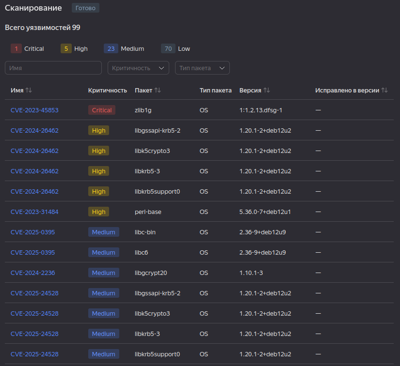

# Домашнее задание к занятию 5. «Практическое применение Docker»


---

## Задача 1
1. Сделайте в своем github пространстве fork [репозитория](https://github.com/netology-code/shvirtd-example-python/blob/main/README.md).
   Примечание: В связи с доработкой кода python приложения. Если вы уверены что задание выполнено вами верно, а код python приложения работает с ошибкой то используйте вместо main.py файл not_tested_main.py(просто измените CMD)
3. Создайте файл с именем ```Dockerfile.python``` для сборки данного проекта(для 3 задания изучите https://docs.docker.com/compose/compose-file/build/ ). Используйте базовый образ ```python:3.9-slim```. 
Обязательно используйте конструкцию ```COPY . .``` в Dockerfile. Не забудьте исключить ненужные в имадже файлы с помощью dockerignore. Протестируйте корректность сборки.  
4. (Необязательная часть, *) Изучите инструкцию в проекте и запустите web-приложение без использования docker в venv. (Mysql БД можно запустить в docker run).
5. (Необязательная часть, *) По образцу предоставленного python кода внесите в него исправление для управления названием используемой таблицы через ENV переменную.
---
### ВНИМАНИЕ!
!!! В процессе последующего выполнения ДЗ НЕ изменяйте содержимое файлов в fork-репозитории! Ваша задача ДОБАВИТЬ 5 файлов: ```Dockerfile.python```, ```compose.yaml```, ```.gitignore```, ```.dockerignore```,```bash-скрипт```. Если вам понадобилось внести иные изменения в проект - вы что-то делаете неверно!
---

## Решение 1

mysql

```
$ docker run --name mysql -e MYSQL_ROOT_PASSWORD="YtReWq4321" -e MYSQL_DATABASE="virtd" -e MYSQL_USER="app" -e MYSQL_PASSWORD="QwErTy1234" -d mysql:9

Unable to find image 'mysql:9' locally
9: Pulling from library/mysql
2c0a233485c3: Pull complete 
21577e00f2ba: Pull complete 
c294da35c13e: Pull complete 
facc8f3107c1: Pull complete 
de4342aa4ad8: Pull complete 
4643f1cf56c2: Pull complete 
139aca660b47: Pull complete 
b10e1082570e: Pull complete 
26313a3e0799: Pull complete 
d43055c38217: Pull complete 
Digest: sha256:45f5ae20cfe1d6e6c43684dfffef17db1e1e8dc9bf7133ceaafb25c16b10f31b
Status: Downloaded newer image for mysql:9
7cc5fb79f785cfa6c3595ad8e85021c9e7a6c4973861cd920f7c9b5d1d72e68d

$ docker ps

CONTAINER ID   IMAGE     COMMAND                  CREATED          STATUS          PORTS                                                  NAMES
7cc5fb79f785   mysql:9   "docker-entrypoint.s…"   14 seconds ago   Up 14 seconds   0.0.0.0:3306->3306/tcp, :::3306->3306/tcp, 33060/tcp   mysql

```

app dockerfile

```
$ cat Dockerfile.python 

FROM python:3.9-slim

WORKDIR /app

ARG DB_HOST="localhost"
ARG DB_USER="app"
ARG DB_PASSWORD=""
ARG DB_NAME=""

ENV DB_HOST=${DB_HOST}
ENV DB_USER=${DB_USER}
ENV DB_PASSWORD=${DB_PASSWORD}
ENV DB_NAME=${DB_NAME}

COPY . .
RUN python -m pip install --no-cache-dir -r requirements.txt

EXPOSE 5000

CMD ["python", "main.py"]

```

build


```
$ docker build --tag test-app:1.0.0 -f Dockerfile.python --no-cache .
[+] Building 13.2s (9/9) FINISHED                                                                                                                                     docker:default
 => [internal] load build definition from Dockerfile.python                                                                                                                     0.0s
 => => transferring dockerfile: 371B                                                                                                                                            0.0s
 => WARN: SecretsUsedInArgOrEnv: Do not use ARG or ENV instructions for sensitive data (ARG "DB_PASSWORD") (line 7)                                                             0.0s
 => WARN: SecretsUsedInArgOrEnv: Do not use ARG or ENV instructions for sensitive data (ENV "DB_PASSWORD") (line 12)                                                            0.0s
 => [internal] load metadata for docker.io/library/python:3.9-slim                                                                                                              0.0s
 => [internal] load .dockerignore                                                                                                                                               0.0s
 => => transferring context: 118B                                                                                                                                               0.0s
 => [1/4] FROM docker.io/library/python:3.9-slim                                                                                                                                0.0s
 => CACHED [2/4] WORKDIR /app                                                                                                                                                   0.0s
 => [internal] load build context                                                                                                                                               0.0s
 => => transferring context: 315B                                                                                                                                               0.0s
 => [3/4] COPY . .                                                                                                                                                              0.0s
 => [4/4] RUN python -m pip install --no-cache-dir -r requirements.txt                                                                                                         12.8s
 => exporting to image                                                                                                                                                          0.4s 
 => => exporting layers                                                                                                                                                         0.4s 
 => => writing image sha256:991222830a3b35f5fa20d8102e5ddbd943302ba6db0926c27d4bfa2c913234b5                                                                                    0.0s 
 => => naming to docker.io/library/test-app:1.0.0                                                                                                                               0.0s 
                                                                                                                                                                                     
 2 warnings found (use docker --debug to expand):                                                                                                                                    
 - SecretsUsedInArgOrEnv: Do not use ARG or ENV instructions for sensitive data (ARG "DB_PASSWORD") (line 7)
 - SecretsUsedInArgOrEnv: Do not use ARG or ENV instructions for sensitive data (ENV "DB_PASSWORD") (line 12)
```

app run

```
$ docker run --rm -d --name test-app -e DB_HOST="localhost" -e DB_USER="app" -e DB_PASSWORD="QwErTy1234" -e DB_NAME="virtd" --network host test-app:1.0.0

e535a88dfe6f8af88999a1ee56a8b3af27fe636d0d283aff21d05f5bb17dd255

$ curl localhost:5000

TIME: 2025-02-02 12:44:06, IP: None

$ docker logs test-app

 * Tip: There are .env files present. Install python-dotenv to use them.
 * Serving Flask app 'main'
 * Debug mode: on
WARNING: This is a development server. Do not use it in a production deployment. Use a production WSGI server instead.
 * Running on all addresses (0.0.0.0)
 * Running on http://127.0.0.1:5000
 * Running on http://192.168.80.129:5000
Press CTRL+C to quit
 * Restarting with stat
 * Tip: There are .env files present. Install python-dotenv to use them.
 * Debugger is active!
 * Debugger PIN: 831-802-044
127.0.0.1 - - [02/Feb/2025 12:44:06] "GET / HTTP/1.1" 200 -

```


---

## Задача 2 (*)
1. Создайте в yandex cloud container registry с именем "test" с помощью "yc tool" . [Инструкция](https://cloud.yandex.ru/ru/docs/container-registry/quickstart/?from=int-console-help)
2. Настройте аутентификацию вашего локального docker в yandex container registry.
3. Соберите и залейте в него образ с python приложением из задания №1.
4. Просканируйте образ на уязвимости.
5. В качестве ответа приложите отчет сканирования.

---

## Решение 2

```
$ yc container registry create --name test

done (2s)
id: ************
folder_id: ********************
name: test
status: ACTIVE
created_at: "2025-02-02T13:22:14.086Z"

There is a new yc version '0.142.0' available. Current version: '0.141.0'.
See release notes at https://yandex.cloud/ru/docs/cli/release-notes
You can install it by running the following command in your shell:
	$ yc components update

```

```
$ yc container registry configure-docker

docker configured to use yc --profile "default" for authenticating "cr.yandex" container registries
Credential helper is configured in '/home/sergey/.docker/config.json'

$ cat /home/sergey/.docker/config.json
{
  "credHelpers": {
    "container-registry.cloud.yandex.net": "yc",
    "cr.cloud.yandex.net": "yc",
    "cr.yandex": "yc"
  }

```

```
$ docker tag test-app:1.0.0 cr.yandex/****************/test-app:1.0.0


$ docker push cr.yandex/********************/test-app:1.0.0

The push refers to repository [cr.yandex/**************/test-app]
1dcb04ce0655: Pushed 
c17d35980507: Pushed 
591b31ab06dd: Pushed 
9ab7333053f8: Pushed 
c0ecdab1104b: Pushed 
6f208d2e47a8: Pushed 
f5fe472da253: Pushed 
1.0.0: digest: sha256:fb7e3021ae22a053ffdd98ec62ffd26654f471b8008b170539837dcbf7e2006a size: 1785

```
Результат проверки

```
cat vulnerabilities.csv 

name,link,severity,package,version,fixedBy
CVE-2023-45853,https://avd.aquasec.com/nvd/cve-2023-45853,CRITICAL,zlib1g,1:1.2.13.dfsg-1,
CVE-2024-26462,https://avd.aquasec.com/nvd/cve-2024-26462,HIGH,libgssapi-krb5-2,1.20.1-2+deb12u2,
CVE-2024-26462,https://avd.aquasec.com/nvd/cve-2024-26462,HIGH,libk5crypto3,1.20.1-2+deb12u2,
CVE-2024-26462,https://avd.aquasec.com/nvd/cve-2024-26462,HIGH,libkrb5-3,1.20.1-2+deb12u2,
CVE-2024-26462,https://avd.aquasec.com/nvd/cve-2024-26462,HIGH,libkrb5support0,1.20.1-2+deb12u2,
CVE-2023-31484,https://avd.aquasec.com/nvd/cve-2023-31484,HIGH,perl-base,5.36.0-7+deb12u1,
CVE-2025-0395,https://avd.aquasec.com/nvd/cve-2025-0395,MEDIUM,libc-bin,2.36-9+deb12u9,
CVE-2025-0395,https://avd.aquasec.com/nvd/cve-2025-0395,MEDIUM,libc6,2.36-9+deb12u9,
CVE-2024-2236,https://avd.aquasec.com/nvd/cve-2024-2236,MEDIUM,libgcrypt20,1.10.1-3,
CVE-2025-24528,https://avd.aquasec.com/nvd/cve-2025-24528,MEDIUM,libgssapi-krb5-2,1.20.1-2+deb12u2,
CVE-2025-24528,https://avd.aquasec.com/nvd/cve-2025-24528,MEDIUM,libk5crypto3,1.20.1-2+deb12u2,
CVE-2025-24528,https://avd.aquasec.com/nvd/cve-2025-24528,MEDIUM,libkrb5-3,1.20.1-2+deb12u2,
CVE-2025-24528,https://avd.aquasec.com/nvd/cve-2025-24528,MEDIUM,libkrb5support0,1.20.1-2+deb12u2,
CVE-2023-50495,https://avd.aquasec.com/nvd/cve-2023-50495,MEDIUM,libncursesw6,6.4-4,
CVE-2024-10041,https://avd.aquasec.com/nvd/cve-2024-10041,MEDIUM,libpam-modules,1.5.2-6+deb12u1,
CVE-2024-22365,https://avd.aquasec.com/nvd/cve-2024-22365,MEDIUM,libpam-modules,1.5.2-6+deb12u1,
CVE-2024-10041,https://avd.aquasec.com/nvd/cve-2024-10041,MEDIUM,libpam-modules-bin,1.5.2-6+deb12u1,
CVE-2024-22365,https://avd.aquasec.com/nvd/cve-2024-22365,MEDIUM,libpam-modules-bin,1.5.2-6+deb12u1,
CVE-2024-10041,https://avd.aquasec.com/nvd/cve-2024-10041,MEDIUM,libpam-runtime,1.5.2-6+deb12u1,
CVE-2024-22365,https://avd.aquasec.com/nvd/cve-2024-22365,MEDIUM,libpam-runtime,1.5.2-6+deb12u1,
CVE-2024-10041,https://avd.aquasec.com/nvd/cve-2024-10041,MEDIUM,libpam0g,1.5.2-6+deb12u1,
CVE-2024-22365,https://avd.aquasec.com/nvd/cve-2024-22365,MEDIUM,libpam0g,1.5.2-6+deb12u1,
CVE-2024-13176,https://avd.aquasec.com/nvd/cve-2024-13176,MEDIUM,libssl3,3.0.15-1~deb12u1,
CVE-2023-50495,https://avd.aquasec.com/nvd/cve-2023-50495,MEDIUM,libtinfo6,6.4-4,
CVE-2023-4641,https://avd.aquasec.com/nvd/cve-2023-4641,MEDIUM,login,1:4.13+dfsg1-1+b1,
CVE-2023-50495,https://avd.aquasec.com/nvd/cve-2023-50495,MEDIUM,ncurses-base,6.4-4,
CVE-2023-50495,https://avd.aquasec.com/nvd/cve-2023-50495,MEDIUM,ncurses-bin,6.4-4,
CVE-2024-13176,https://avd.aquasec.com/nvd/cve-2024-13176,MEDIUM,openssl,3.0.15-1~deb12u1,
CVE-2023-4641,https://avd.aquasec.com/nvd/cve-2023-4641,MEDIUM,passwd,1:4.13+dfsg1-1+b1,
CVE-2011-3374,https://avd.aquasec.com/nvd/cve-2011-3374,LOW,apt,2.6.1,
TEMP-0841856-B18BAF,https://security-tracker.debian.org/tracker/TEMP-0841856-B18BAF,LOW,bash,5.2.15-2+b7,
CVE-2022-0563,https://avd.aquasec.com/nvd/cve-2022-0563,LOW,bsdutils,1:2.38.1-5+deb12u3,
CVE-2016-2781,https://avd.aquasec.com/nvd/cve-2016-2781,LOW,coreutils,9.1-1,
CVE-2017-18018,https://avd.aquasec.com/nvd/cve-2017-18018,LOW,coreutils,9.1-1,
CVE-2022-27943,https://avd.aquasec.com/nvd/cve-2022-27943,LOW,gcc-12-base,12.2.0-14,
CVE-2023-4039,https://avd.aquasec.com/nvd/cve-2023-4039,LOW,gcc-12-base,12.2.0-14,
CVE-2022-3219,https://avd.aquasec.com/nvd/cve-2022-3219,LOW,gpgv,2.2.40-1.1,
CVE-2011-3374,https://avd.aquasec.com/nvd/cve-2011-3374,LOW,libapt-pkg6.0,2.6.1,
CVE-2022-0563,https://avd.aquasec.com/nvd/cve-2022-0563,LOW,libblkid1,2.38.1-5+deb12u3,
CVE-2010-4756,https://avd.aquasec.com/nvd/cve-2010-4756,LOW,libc-bin,2.36-9+deb12u9,
CVE-2018-20796,https://avd.aquasec.com/nvd/cve-2018-20796,LOW,libc-bin,2.36-9+deb12u9,
CVE-2019-1010022,https://avd.aquasec.com/nvd/cve-2019-1010022,LOW,libc-bin,2.36-9+deb12u9,
CVE-2019-1010023,https://avd.aquasec.com/nvd/cve-2019-1010023,LOW,libc-bin,2.36-9+deb12u9,
CVE-2019-1010024,https://avd.aquasec.com/nvd/cve-2019-1010024,LOW,libc-bin,2.36-9+deb12u9,
CVE-2019-1010025,https://avd.aquasec.com/nvd/cve-2019-1010025,LOW,libc-bin,2.36-9+deb12u9,
CVE-2019-9192,https://avd.aquasec.com/nvd/cve-2019-9192,LOW,libc-bin,2.36-9+deb12u9,
CVE-2010-4756,https://avd.aquasec.com/nvd/cve-2010-4756,LOW,libc6,2.36-9+deb12u9,
CVE-2018-20796,https://avd.aquasec.com/nvd/cve-2018-20796,LOW,libc6,2.36-9+deb12u9,
CVE-2019-1010022,https://avd.aquasec.com/nvd/cve-2019-1010022,LOW,libc6,2.36-9+deb12u9,
CVE-2019-1010023,https://avd.aquasec.com/nvd/cve-2019-1010023,LOW,libc6,2.36-9+deb12u9,
CVE-2019-1010024,https://avd.aquasec.com/nvd/cve-2019-1010024,LOW,libc6,2.36-9+deb12u9,
CVE-2019-1010025,https://avd.aquasec.com/nvd/cve-2019-1010025,LOW,libc6,2.36-9+deb12u9,
CVE-2019-9192,https://avd.aquasec.com/nvd/cve-2019-9192,LOW,libc6,2.36-9+deb12u9,
CVE-2022-27943,https://avd.aquasec.com/nvd/cve-2022-27943,LOW,libgcc-s1,12.2.0-14,
CVE-2023-4039,https://avd.aquasec.com/nvd/cve-2023-4039,LOW,libgcc-s1,12.2.0-14,
CVE-2018-6829,https://avd.aquasec.com/nvd/cve-2018-6829,LOW,libgcrypt20,1.10.1-3,
CVE-2011-3389,https://avd.aquasec.com/nvd/cve-2011-3389,LOW,libgnutls30,3.7.9-2+deb12u3,
CVE-2018-5709,https://avd.aquasec.com/nvd/cve-2018-5709,LOW,libgssapi-krb5-2,1.20.1-2+deb12u2,
CVE-2024-26458,https://avd.aquasec.com/nvd/cve-2024-26458,LOW,libgssapi-krb5-2,1.20.1-2+deb12u2,
CVE-2024-26461,https://avd.aquasec.com/nvd/cve-2024-26461,LOW,libgssapi-krb5-2,1.20.1-2+deb12u2,
CVE-2018-5709,https://avd.aquasec.com/nvd/cve-2018-5709,LOW,libk5crypto3,1.20.1-2+deb12u2,
CVE-2024-26458,https://avd.aquasec.com/nvd/cve-2024-26458,LOW,libk5crypto3,1.20.1-2+deb12u2,
CVE-2024-26461,https://avd.aquasec.com/nvd/cve-2024-26461,LOW,libk5crypto3,1.20.1-2+deb12u2,
CVE-2018-5709,https://avd.aquasec.com/nvd/cve-2018-5709,LOW,libkrb5-3,1.20.1-2+deb12u2,
CVE-2024-26458,https://avd.aquasec.com/nvd/cve-2024-26458,LOW,libkrb5-3,1.20.1-2+deb12u2,
CVE-2024-26461,https://avd.aquasec.com/nvd/cve-2024-26461,LOW,libkrb5-3,1.20.1-2+deb12u2,
CVE-2018-5709,https://avd.aquasec.com/nvd/cve-2018-5709,LOW,libkrb5support0,1.20.1-2+deb12u2,
CVE-2024-26458,https://avd.aquasec.com/nvd/cve-2024-26458,LOW,libkrb5support0,1.20.1-2+deb12u2,
CVE-2024-26461,https://avd.aquasec.com/nvd/cve-2024-26461,LOW,libkrb5support0,1.20.1-2+deb12u2,
CVE-2022-0563,https://avd.aquasec.com/nvd/cve-2022-0563,LOW,libmount1,2.38.1-5+deb12u3,
CVE-2022-0563,https://avd.aquasec.com/nvd/cve-2022-0563,LOW,libsmartcols1,2.38.1-5+deb12u3,
CVE-2021-45346,https://avd.aquasec.com/nvd/cve-2021-45346,LOW,libsqlite3-0,3.40.1-2+deb12u1,
CVE-2022-27943,https://avd.aquasec.com/nvd/cve-2022-27943,LOW,libstdc++6,12.2.0-14,
CVE-2023-4039,https://avd.aquasec.com/nvd/cve-2023-4039,LOW,libstdc++6,12.2.0-14,
CVE-2013-4392,https://avd.aquasec.com/nvd/cve-2013-4392,LOW,libsystemd0,252.33-1~deb12u1,
CVE-2023-31437,https://avd.aquasec.com/nvd/cve-2023-31437,LOW,libsystemd0,252.33-1~deb12u1,
CVE-2023-31438,https://avd.aquasec.com/nvd/cve-2023-31438,LOW,libsystemd0,252.33-1~deb12u1,
CVE-2023-31439,https://avd.aquasec.com/nvd/cve-2023-31439,LOW,libsystemd0,252.33-1~deb12u1,
CVE-2013-4392,https://avd.aquasec.com/nvd/cve-2013-4392,LOW,libudev1,252.33-1~deb12u1,
CVE-2023-31437,https://avd.aquasec.com/nvd/cve-2023-31437,LOW,libudev1,252.33-1~deb12u1,
CVE-2023-31438,https://avd.aquasec.com/nvd/cve-2023-31438,LOW,libudev1,252.33-1~deb12u1,
CVE-2023-31439,https://avd.aquasec.com/nvd/cve-2023-31439,LOW,libudev1,252.33-1~deb12u1,
CVE-2022-0563,https://avd.aquasec.com/nvd/cve-2022-0563,LOW,libuuid1,2.38.1-5+deb12u3,
CVE-2007-5686,https://avd.aquasec.com/nvd/cve-2007-5686,LOW,login,1:4.13+dfsg1-1+b1,
CVE-2023-29383,https://avd.aquasec.com/nvd/cve-2023-29383,LOW,login,1:4.13+dfsg1-1+b1,
CVE-2024-56433,https://avd.aquasec.com/nvd/cve-2024-56433,LOW,login,1:4.13+dfsg1-1+b1,
TEMP-0628843-DBAD28,https://security-tracker.debian.org/tracker/TEMP-0628843-DBAD28,LOW,login,1:4.13+dfsg1-1+b1,
CVE-2022-0563,https://avd.aquasec.com/nvd/cve-2022-0563,LOW,mount,2.38.1-5+deb12u3,
CVE-2007-5686,https://avd.aquasec.com/nvd/cve-2007-5686,LOW,passwd,1:4.13+dfsg1-1+b1,
CVE-2023-29383,https://avd.aquasec.com/nvd/cve-2023-29383,LOW,passwd,1:4.13+dfsg1-1+b1,
CVE-2024-56433,https://avd.aquasec.com/nvd/cve-2024-56433,LOW,passwd,1:4.13+dfsg1-1+b1,
TEMP-0628843-DBAD28,https://security-tracker.debian.org/tracker/TEMP-0628843-DBAD28,LOW,passwd,1:4.13+dfsg1-1+b1,
CVE-2011-4116,https://avd.aquasec.com/nvd/cve-2011-4116,LOW,perl-base,5.36.0-7+deb12u1,
CVE-2023-31486,https://avd.aquasec.com/nvd/cve-2023-31486,LOW,perl-base,5.36.0-7+deb12u1,
TEMP-0517018-A83CE6,https://security-tracker.debian.org/tracker/TEMP-0517018-A83CE6,LOW,sysvinit-utils,3.06-4,
CVE-2005-2541,https://avd.aquasec.com/nvd/cve-2005-2541,LOW,tar,1.34+dfsg-1.2+deb12u1,
TEMP-0290435-0B57B5,https://security-tracker.debian.org/tracker/TEMP-0290435-0B57B5,LOW,tar,1.34+dfsg-1.2+deb12u1,
CVE-2022-0563,https://avd.aquasec.com/nvd/cve-2022-0563,LOW,util-linux,2.38.1-5+deb12u3,
CVE-2022-0563,https://avd.aquasec.com/nvd/cve-2022-0563,LOW,util-linux-extra,2.38.1-5+deb12u3,
```



---

## Задача 3
1. Изучите файл "proxy.yaml"
2. Создайте в репозитории с проектом файл ```compose.yaml```. С помощью директивы "include" подключите к нему файл "proxy.yaml".
3. Опишите в файле ```compose.yaml``` следующие сервисы: 

- ```web```. Образ приложения должен ИЛИ собираться при запуске compose из файла ```Dockerfile.python``` ИЛИ скачиваться из yandex cloud container registry(из задание №2 со *). Контейнер должен работать в bridge-сети с названием ```backend``` и иметь фиксированный ipv4-адрес ```172.20.0.5```. Сервис должен всегда перезапускаться в случае ошибок.
Передайте необходимые ENV-переменные для подключения к Mysql базе данных по сетевому имени сервиса ```web``` 

- ```db```. image=mysql:8. Контейнер должен работать в bridge-сети с названием ```backend``` и иметь фиксированный ipv4-адрес ```172.20.0.10```. Явно перезапуск сервиса в случае ошибок. Передайте необходимые ENV-переменные для создания: пароля root пользователя, создания базы данных, пользователя и пароля для web-приложения.Обязательно используйте уже существующий .env file для назначения секретных ENV-переменных!

2. Запустите проект локально с помощью docker compose , добейтесь его стабильной работы: команда ```curl -L http://127.0.0.1:8090``` должна возвращать в качестве ответа время и локальный IP-адрес. Если сервисы не стартуют воспользуйтесь командами: ```docker ps -a ``` и ```docker logs <container_name>``` . Если вместо IP-адреса вы получаете ```NULL``` --убедитесь, что вы шлете запрос на порт ```8090```, а не 5000.

5. Подключитесь к БД mysql с помощью команды ```docker exec -ti <имя_контейнера> mysql -uroot -p<пароль root-пользователя>```(обратите внимание что между ключем -u и логином root нет пробела. это важно!!! тоже самое с паролем) . Введите последовательно команды (не забываем в конце символ ; ): ```show databases; use <имя вашей базы данных(по-умолчанию example)>; show tables; SELECT * from requests LIMIT 10;```.

6. Остановите проект. В качестве ответа приложите скриншот sql-запроса.

---
## Решение 3

```
$ cat compose.yaml 

version: '3.8'
include:
  - proxy.yaml
services:
  web:
    container_name: web
    build: 
      context: .
      dockerfile: Dockerfile.python
    restart: always
    env_file: .env
    environment:
      DB_HOST: db
      DB_USER: ${MYSQL_USER}
      DB_PASSWORD: ${MYSQL_PASSWORD}
      DB_NAME: ${MYSQL_DATABASE}
    ports:
      - "5000:5000"
    networks:
      backend:
        ipv4_address: 172.20.0.5
  
  db:
    image: mysql:8
    restart: always
    env_file: .env
    environment:
      MYSQL_ROOT_PASSWORD: ${MYSQL_ROOT_PASSWORD}
      MYSQL_DATABASE: ${MYSQL_DATABASE}
      MYSQL_USER: ${MYSQL_USER}
      MYSQL_PASSWORD: ${MYSQL_PASSWORD}
    ports:
      - "3306:3306"
    networks:
      backend:
        ipv4_address: 172.20.0.10

networks:
  backend:
    driver: bridge
    ipam:
     config:
       - subnet: 172.20.0.0/24
```

```
$ docker compose up -d

WARN[0000] /home/sergey/Work/netology-devops/virtualization/shvirtd-example-python/proxy.yaml: the attribute `version` is obsolete, it will be ignored, please remove it to avoid potential confusion 
WARN[0000] /home/sergey/Work/netology-devops/virtualization/shvirtd-example-python/compose.yaml: the attribute `version` is obsolete, it will be ignored, please remove it to avoid potential confusion 
[+] Running 24/24
 ✔ reverse-proxy Pulled                                                                                                                                                        30.4s 
   ✔ af302e5c37e9 Already exists                                                                                                                                                0.0s 
   ✔ 2ad3384282a0 Pull complete                                                                                                                                                 2.2s 
   ✔ d48a9cb4ef6c Pull complete                                                                                                                                                 3.6s 
   ✔ 77d99d3e1cc3 Pull complete                                                                                                                                                11.1s 
   ✔ 9832235a3273 Pull complete                                                                                                                                                16.1s 
 ✔ db Pulled                                                                                                                                                                   44.9s 
   ✔ 2c0a233485c3 Pull complete                                                                                                                                                 8.2s 
   ✔ ecb40fda03e3 Pull complete                                                                                                                                                 8.3s 
   ✔ 1c6c73d8c7a7 Pull complete                                                                                                                                                 8.3s 
   ✔ 986789341eb6 Pull complete                                                                                                                                                 8.6s 
   ✔ 720920ea2b0b Pull complete                                                                                                                                                 8.6s 
   ✔ 8789191db836 Pull complete                                                                                                                                                 8.6s 
   ✔ 311a2cd705b0 Pull complete                                                                                                                                                29.9s 
   ✔ 3883debd05a3 Pull complete                                                                                                                                                29.9s 
   ✔ bdca1d64207d Pull complete                                                                                                                                                40.1s 
   ✔ 3add1d61b6f4 Pull complete                                                                                                                                                40.1s 
 ✔ ingress-proxy Pulled                                                                                                                                                        10.0s 
   ✔ a330b6cecb98 Already exists                                                                                                                                                0.0s 
   ✔ 5ef80e6f29b5 Already exists                                                                                                                                                0.0s 
   ✔ f699b0db74e3 Already exists                                                                                                                                                0.0s 
   ✔ 0f701a34c55e Already exists                                                                                                                                                0.0s 
   ✔ 3229dce7b89c Already exists                                                                                                                                                0.0s 
   ✔ ddb78cb2d047 Already exists                                                                                                                                                0.0s 
[+] Building 3.9s (10/10) FINISHED                                                                                                                                    docker:default
 => [web internal] load build definition from Dockerfile.python                                                                                                                 0.0s
 => => transferring dockerfile: 371B                                                                                                                                            0.0s
 => [web internal] load metadata for docker.io/library/python:3.9-slim                                                                                                          3.7s
 => [web internal] load .dockerignore                                                                                                                                           0.0s
 => => transferring context: 118B                                                                                                                                               0.0s
 => [web 1/4] FROM docker.io/library/python:3.9-slim@sha256:bb8009c87ab69e751a1dd2c6c7f8abaae3d9fce8e072802d4a23c95594d16d84                                                    0.0s
 => [web internal] load build context                                                                                                                                           0.1s
 => => transferring context: 119B                                                                                                                                               0.0s
 => CACHED [web 2/4] WORKDIR /app                                                                                                                                               0.0s
 => CACHED [web 3/4] COPY . .                                                                                                                                                   0.0s
 => CACHED [web 4/4] RUN python -m pip install --no-cache-dir -r requirements.txt                                                                                               0.0s
 => [web] exporting to image                                                                                                                                                    0.0s
 => => exporting layers                                                                                                                                                         0.0s
 => => writing image sha256:a9145f57c87ad3dfeac17af4aef7d06fa56aae63b630d65d5e8312060cb270c5                                                                                    0.0s
 => => naming to docker.io/library/shvirtd-example-python-web                                                                                                                   0.0s
 => [web] resolving provenance for metadata file                                                                                                                                0.0s
[+] Running 5/5
 ✔ web                                               Built                                                                                                                      0.0s 
 ✔ Container web                                     Started                                                                                                                    1.4s 
 ✔ Container shvirtd-example-python-db-1             Started                                                                                                                    1.7s 
 ✔ Container shvirtd-example-python-ingress-proxy-1  Started                                                                                                                    0.9s 
 ✔ Container shvirtd-example-python-reverse-proxy-1  Started                                                                                                                    1.4s 

```

```
$ curl -L http://127.0.0.1:8090

TIME: 2025-02-02 14:50:59, IP: 127.0.0.1
```

```
$ docker exec -ti shvirtd-example-python-db-1 mysql -uroot -pYtReWq4321

mysql: [Warning] Using a password on the command line interface can be insecure.
Welcome to the MySQL monitor.  Commands end with ; or \g.
Your MySQL connection id is 10
Server version: 8.4.4 MySQL Community Server - GPL

Copyright (c) 2000, 2025, Oracle and/or its affiliates.

Oracle is a registered trademark of Oracle Corporation and/or its
affiliates. Other names may be trademarks of their respective
owners.

Type 'help;' or '\h' for help. Type '\c' to clear the current input statement.

mysql> show databases;
+--------------------+
| Database           |
+--------------------+
| information_schema |
| mysql              |
| performance_schema |
| sys                |
| virtd              |
+--------------------+
5 rows in set (0.01 sec)

mysql> use virtd;
Reading table information for completion of table and column names
You can turn off this feature to get a quicker startup with -A

Database changed
mysql> show tables;
+-----------------+
| Tables_in_virtd |
+-----------------+
| requests        |
+-----------------+
1 row in set (0.00 sec)

mysql> SELECT * from requests LIMIT 10;
+----+---------------------+------------+
| id | request_date        | request_ip |
+----+---------------------+------------+
|  1 | 2025-02-02 14:50:59 | 127.0.0.1  |
+----+---------------------+------------+
1 row in set (0.00 sec)

mysql> quit;
Bye
```

---


## Задача 4
1. Запустите в Yandex Cloud ВМ (вам хватит 2 Гб Ram).
2. Подключитесь к Вм по ssh и установите docker.
3. Напишите bash-скрипт, который скачает ваш fork-репозиторий в каталог /opt и запустит проект целиком.
4. Зайдите на сайт проверки http подключений, например(или аналогичный): ```https://check-host.net/check-http``` и запустите проверку вашего сервиса ```http://<внешний_IP-адрес_вашей_ВМ>:8090```. Таким образом трафик будет направлен в ingress-proxy. ПРИМЕЧАНИЕ:  приложение main.py( в отличие от not_tested_main.py) весьма вероятно упадет под нагрузкой, но успеет обработать часть запросов - этого достаточно. Обновленная версия (main.py) не прошла достаточного тестирования временем, но должна справиться с нагрузкой.
5. (Необязательная часть) Дополнительно настройте remote ssh context к вашему серверу. Отобразите список контекстов и результат удаленного выполнения ```docker ps -a```
6. В качестве ответа повторите  sql-запрос и приложите скриншот с данного сервера, bash-скрипт и ссылку на fork-репозиторий.

---

## Решение 4


```
# ./run_lab

Cloning into 'netology-devops'...
remote: Enumerating objects: 2073, done.
remote: Counting objects: 100% (2073/2073), done.
remote: Compressing objects: 100% (1876/1876), done.
remote: Total 2073 (delta 172), reused 2062 (delta 166), pack-reused 0 (from 0)
Receiving objects: 100% (2073/2073), 28.20 MiB | 24.43 MiB/s, done.
Resolving deltas: 100% (172/172), done.
WARN[0002] /opt/shvirtd/proxy.yaml: the attribute `version` is obsolete, it will be ignored, please remove it to avoid potential confusion 
WARN[0002] /opt/shvirtd/compose.yaml: the attribute `version` is obsolete, it will be ignored, please remove it to avoid potential confusion 
[+] Running 24/24
 ✔ ingress-proxy Pulled                                                                                                                                                        30.6s 
   ✔ a330b6cecb98 Pull complete                                                                                                                                                 6.8s 
   ✔ 5ef80e6f29b5 Pull complete                                                                                                                                                19.6s 
   ✔ f699b0db74e3 Pull complete                                                                                                                                                23.1s 
   ✔ 0f701a34c55e Pull complete                                                                                                                                                23.7s 
   ✔ 3229dce7b89c Pull complete                                                                                                                                                23.9s 
   ✔ ddb78cb2d047 Pull complete                                                                                                                                                24.0s 
 ✔ db Pulled                                                                                                                                                                   53.0s 
   ✔ 2c0a233485c3 Pull complete                                                                                                                                                 6.4s 
   ✔ ecb40fda03e3 Pull complete                                                                                                                                                 7.8s 
   ✔ 1c6c73d8c7a7 Pull complete                                                                                                                                                 9.5s 
   ✔ 986789341eb6 Pull complete                                                                                                                                                12.6s 
   ✔ 720920ea2b0b Pull complete                                                                                                                                                15.4s 
   ✔ 8789191db836 Pull complete                                                                                                                                                18.1s 
   ✔ 311a2cd705b0 Pull complete                                                                                                                                                20.0s 
   ✔ 3883debd05a3 Pull complete                                                                                                                                                20.1s 
   ✔ bdca1d64207d Pull complete                                                                                                                                                41.0s 
   ✔ 3add1d61b6f4 Pull complete                                                                                                                                                41.1s 
 ✔ reverse-proxy Pulled                                                                                                                                                        28.7s 
   ✔ af302e5c37e9 Pull complete                                                                                                                                                 6.8s 
   ✔ 2ad3384282a0 Pull complete                                                                                                                                                 9.7s 
   ✔ d48a9cb4ef6c Pull complete                                                                                                                                                11.2s 
   ✔ 77d99d3e1cc3 Pull complete                                                                                                                                                15.7s 
   ✔ 9832235a3273 Pull complete                                                                                                                                                19.4s 
[+] Building 108.1s (10/10) FINISHED                                                                                                                                  docker:default
 => [web internal] load build definition from Dockerfile.python                                                                                                                 1.0s
 => => transferring dockerfile: 371B                                                                                                                                            0.1s
 => [web internal] load metadata for docker.io/library/python:3.9-slim                                                                                                          4.1s
 => [web internal] load .dockerignore                                                                                                                                           0.2s
 => => transferring context: 2B                                                                                                                                                 0.0s
 => [web 1/4] FROM docker.io/library/python:3.9-slim@sha256:bb8009c87ab69e751a1dd2c6c7f8abaae3d9fce8e072802d4a23c95594d16d84                                                    4.6s
 => => resolve docker.io/library/python:3.9-slim@sha256:bb8009c87ab69e751a1dd2c6c7f8abaae3d9fce8e072802d4a23c95594d16d84                                                        0.1s
 => => sha256:bb8009c87ab69e751a1dd2c6c7f8abaae3d9fce8e072802d4a23c95594d16d84 10.41kB / 10.41kB                                                                                0.0s
 => => sha256:ddb56f2e39ec00c79c1207f182c60e03ddfdf417525b56ef467e1519706792cd 1.75kB / 1.75kB                                                                                  0.0s
 => => sha256:453d3342b002fa5f904ba0cd72a07accb5121641d20776f3e64339842f275d38 5.28kB / 5.28kB                                                                                  0.0s
 => => sha256:1da0723265ec311debcf6bec17d4fae5f1e5f7809fca4378aac265cdef238f1c 3.51MB / 3.51MB                                                                                  0.6s
 => => sha256:4f4cb1a24c66f1a92f204ba0bbd6d2a7c941a853c83161ffa38bbfa121448861 14.93MB / 14.93MB                                                                                1.0s
 => => sha256:c876ae22765e4a125855eb121718c3f8f07bd8b00dae0ad4e68e716571961f37 249B / 249B                                                                                      1.1s
 => => extracting sha256:1da0723265ec311debcf6bec17d4fae5f1e5f7809fca4378aac265cdef238f1c                                                                                       0.3s
 => => extracting sha256:4f4cb1a24c66f1a92f204ba0bbd6d2a7c941a853c83161ffa38bbfa121448861                                                                                       1.0s
 => => extracting sha256:c876ae22765e4a125855eb121718c3f8f07bd8b00dae0ad4e68e716571961f37                                                                                       0.0s
 => [web internal] load build context                                                                                                                                           9.1s
 => => transferring context: 116.84MB                                                                                                                                           8.8s
 => [web 2/4] WORKDIR /app                                                                                                                                                      3.2s
 => [web 3/4] COPY . .                                                                                                                                                          4.2s
 => [web 4/4] RUN python -m pip install --no-cache-dir -r requirements.txt                                                                                                     87.2s
 => [web] exporting to image                                                                                                                                                    1.3s 
 => => exporting layers                                                                                                                                                         1.2s 
 => => writing image sha256:13f56aed33eb27d678e7a11892f18b32670cc15afa5415bfff22489ce7d5b270                                                                                    0.0s 
 => => naming to docker.io/library/shvirtd-web                                                                                                                                  0.0s 
 => [web] resolving provenance for metadata file                                                                                                                                0.2s 
[+] Running 6/6                                                                                                                                                                      
 ✔ web                                Built                                                                                                                                     0.0s 
 ✔ Network shvirtd_backend            Created                                                                                                                                   0.2s 
 ✔ Container web                      Started                                                                                                                                   3.2s 
 ✔ Container shvirtd-ingress-proxy-1  Started                                                                                                                                   2.9s 
 ✔ Container shvirtd-reverse-proxy-1  Started                                                                                                                                   3.1s 
 ✔ Container shvirtd-db-1             Started                                                                                                                                   3.2s 

```

sql

```
# docker exec -ti shvirtd-db-1 mysql -uroot -pYtReWq4321

mysql: [Warning] Using a password on the command line interface can be insecure.
Welcome to the MySQL monitor.  Commands end with ; or \g.
Your MySQL connection id is 16
Server version: 8.4.4 MySQL Community Server - GPL

Copyright (c) 2000, 2025, Oracle and/or its affiliates.

Oracle is a registered trademark of Oracle Corporation and/or its
affiliates. Other names may be trademarks of their respective
owners.

Type 'help;' or '\h' for help. Type '\c' to clear the current input statement.

mysql> show databases;
+--------------------+
| Database           |
+--------------------+
| information_schema |
| mysql              |
| performance_schema |
| sys                |
| virtd              |
+--------------------+
5 rows in set (0.01 sec)

mysql> use virtd;
Reading table information for completion of table and column names
You can turn off this feature to get a quicker startup with -A

Database changed
mysql> show tables;
+-----------------+
| Tables_in_virtd |
+-----------------+
| requests        |
+-----------------+
1 row in set (0.01 sec)

mysql> SELECT * from requests LIMIT 10;
+----+---------------------+-----------------+
| id | request_date        | request_ip      |
+----+---------------------+-----------------+
|  1 | 2025-02-02 16:17:33 | 195.211.27.85   |
|  2 | 2025-02-02 16:17:33 | 185.37.147.117  |
|  3 | 2025-02-02 16:17:33 | 167.235.135.184 |
|  4 | 2025-02-02 16:17:33 | 45.159.248.77   |
|  5 | 2025-02-02 16:17:33 | 45.141.149.25   |
|  6 | 2025-02-02 16:17:33 | 93.123.16.89    |
|  7 | 2025-02-02 16:17:34 | 141.98.234.68   |
|  8 | 2025-02-02 16:17:34 | 185.25.204.60   |
|  9 | 2025-02-02 16:17:34 | 185.130.104.238 |
| 10 | 2025-02-02 16:17:36 | 103.214.169.52  |
+----+---------------------+-----------------+
10 rows in set (0.01 sec)

mysql> quit;
Bye
```

script

```
# cat run_lab 

cd ~

mkdir /opt/shvirtd

git clone https://github.com/slagovskiy/netology-devops

cp -r ~/netology-devops/virtualization/shvirtd-example-python/* /opt/shvirtd

echo MYSQL_ROOT_PASSWORD="YtReWq4321" > /opt/shvirtd/.env
echo MYSQL_DATABASE="virtd" >> /opt/shvirtd/.env
echo MYSQL_USER="app" >> /opt/shvirtd/.env
echo MYSQL_PASSWORD="QwErTy1234" >> /opt/shvirtd/.env

cd /opt/shvirtd

docker compose up -d

```

---


## Задача 5 (*)
1. Напишите и задеплойте на вашу облачную ВМ bash скрипт, который произведет резервное копирование БД mysql в директорию "/opt/backup" с помощью запуска в сети "backend" контейнера из образа ```schnitzler/mysqldump``` при помощи ```docker run ...``` команды. Подсказка: "документация образа."
2. Протестируйте ручной запуск
3. Настройте выполнение скрипта раз в 1 минуту через cron, crontab или systemctl timer. Придумайте способ не светить логин/пароль в git!!
4. Предоставьте скрипт, cron-task и скриншот с несколькими резервными копиями в "/opt/backup"

---
## Решение 5

Предложенный контейнер плюется ошибкой.

```
mysqldump: Got error: 1045: "Plugin caching_sha2_password could not be loaded: Error loading shared library /usr/lib/mariadb/plugin/caching_sha2_password.so: No such file or directory" when trying to connect
```

Можно чинить, а можно воспользоваться mysqldump-ом, который заведомо рабочий и лежит в контейнере с базой данны, для этого слегка модифицируем compose файл, пробросим в него локальную папку для хранения резервных копий и скрипт, который будем запускать.

Простой скрипт для создания дампа.

```
#!/bin/sh

now=$(date +"%s_%Y-%m-%d")
/usr/bin/mysqldump --opt -h localhost -u root -p${MYSQL_ROOT_PASSWORD} ${MYSQL_DATABASE} > "/backup/${now}_${MYSQL_DATABASE}.sql"
```

Модифицированный compose.

```
version: '3.8'
include:
  - proxy.yaml
services:
  web:
    build:
      context: .
      dockerfile: Dockerfile.python
    restart: always
    env_file: .env
    environment:
      DB_HOST: db
      DB_USER: ${MYSQL_USER}
      DB_PASSWORD: ${MYSQL_PASSWORD}
      DB_NAME: ${MYSQL_DATABASE}
    ports:
      - "5000:5000"
    networks:
      backend:
        ipv4_address: 172.20.0.5

  db:
    image: mysql:8
    restart: always
    env_file: .env
    environment:
      MYSQL_ROOT_PASSWORD: ${MYSQL_ROOT_PASSWORD}
      MYSQL_DATABASE: ${MYSQL_DATABASE}
      MYSQL_USER: ${MYSQL_USER}
      MYSQL_PASSWORD: ${MYSQL_PASSWORD}
    ports:
      - "3306:3306"
    volumes:
      - ./backup:/backup
    networks:
      backend:
        ipv4_address: 172.20.0.10

networks:
  backend:
    driver: bridge
    ipam:
     config:
       - subnet: 172.20.0.0/24
```

Добавлен volume в котором будем хранить дампы, и сам скрипт для создания этих дампов.

Вызываем командой:

```
$ docker exec shvirtd-example-python-db-1 /backup/backup
```

Команду можно поставить в crontab, на пример указав запуск каждую минуту: */1 * * * * 

Но у такого решения, как и у решения с запуском стороннего контейнера есть большой минус, надо знать или имя контейнера, а оно формируется из имени stack-а, или имя сети к которой контейнеру надо подключаться.

```
$ ls -l

-rw-r--r-- 1 root   root   1916 фев  3 21:36 1738593395_2025-02-03_virtd.sql
-rw-r--r-- 1 root   root   1916 фев  3 21:38 1738593494_2025-02-03_virtd.sql
-rwxrwxr-x 1 sergey sergey  168 фев  3 21:38 backup
```

---


## Задача 6
Скачайте docker образ ```hashicorp/terraform:latest``` и скопируйте бинарный файл ```/bin/terraform``` на свою локальную машину, используя dive и docker save.
Предоставьте скриншоты  действий .

---

## Решение 6

```
$ docker pull hashicorp/terraform:latest

latest: Pulling from hashicorp/terraform
210a2ae1a75e: Pull complete 
96a334d74129: Pull complete 
a8d21f258bec: Pull complete 
3601f51a5386: Pull complete 
Digest: sha256:679ac5e095bf550bc726742cd12efa6050f0913080df479fdabfeb202953af28
Status: Downloaded newer image for hashicorp/terraform:latest

$ dive hashicorp/terraform:latest

                                                                                           │ Current Layer Contents ├────────────────────────────────────────────────────────────────
│ Layers ├──────────────────────────────────────────────────────────────────────────────── Permission     UID:GID       Size  Filetree                                               
Cmp   Size  Command                                                                        drwxr-xr-x         0:0      90 MB  ├── bin                                                
    7.8 MB  FROM blobs                                                                     -rwxr-xr-x         0:0      90 MB  │   └── terraform                                      
     18 MB  RUN |4 PRODUCT_VERSION=1.10.5 PRODUCT_REVISION=898e397ebaefb4d0c363b7332b3ba18 drwxr-xr-x         0:0     4.9 kB  └── usr                                                
    4.9 kB  COPY LICENSE /usr/share/doc/terraform/LICENSE.txt # buildkit                   drwxr-xr-x         0:0     4.9 kB      └── share                                          
     90 MB  COPY dist/linux/amd64/terraform /bin/terraform # buildkit                      drwxr-xr-x         0:0     4.9 kB          └── doc                                        
                                                                                           drwxr-xr-x         0:0     4.9 kB              └── terraform                              
                                                                                           -rw-r--r--         0:0     4.9 kB                  └── LICENSE.txt                        
                                                                                                                                                                                     
                                                                                                                                                                                     
                                                                                                                                                                                     
                                                                                                                                                                                     
                                                                                                                                                                                     
                                                                                                                                                                                     
                                                                                                                                                                                     
                                                                                                                                                                                     
                                                                                                                                                                                     
                                                                                                                                                                                     
                                                                                                                                                                                     
                                                                                                                                                                                     
                                                                                                                                                                                     
│ Layer Details ├─────────────────────────────────────────────────────────────────────────                                                                                           
                                                                                                                                                                                     
Tags:   (unavailable)                                                                                                                                                                
Id:     blobs                                                                                                                                                                        
Digest: sha256:da25c3c268493bc8d1313c7698a81a97a99c917ae09a248795e969d82cb53f65                                                                                                      
Command:                                                                                                                                                                             
COPY dist/linux/amd64/terraform /bin/terraform # buildkit                                                                                                                            
                                                                                                                                                                                     
                                                                                                                                                                                     
                                                                                                                                                                                     
                                                                                                                                                                                     
                                                                                                                                                                                     
                                                                                                                                                                                     
                                                                                                                                                                                     
                                                                                                                                                                                     
                                                                                                                                                                                     
                                                                                                                                                                                     
                                                                                                                                                                                     
                                                                                                                                                                                     
                                                                                                                                                                                     
                                                                                                                                                                                     
│ Image Details ├─────────────────────────────────────────────────────────────────────────                                                                                           
                                                                                                                                                                                     
Image name: hashicorp/terraform:latest                                                                                                                                               
Total Image size: 117 MB                                                                                                                                                             
Potential wasted space: 78 kB                                                                                                                                                        
Image efficiency score: 99 %                                                                                                                                                         
                                                                                                                                                                                     
Count   Total Space  Path                                                                                                                                                            
    2         55 kB  /lib/apk/db/installed                                                                                                                                           
    2         22 kB  /lib/apk/db/scripts.tar                                                                                                                                         
    2         190 B  /lib/apk/db/triggers                                                                                                                                            
    2         160 B  /etc/apk/world                                                                                                                                                  
                                                                                                                                                                                     
                                                                                                                                                                                     
                                                                                                                                                                                     
                                                                                                                                                                                     
                                                                                                                                                                                     
                                                                                                                                                                                     
                                                                                                                                                                                     
                                                                                                                                                                                     
                                                                                                                                                                                     
Path Filter:terr                                                                                                                                                                     
▏^C Quit ▏Tab Switch view ▏^F Filter ▏^L Show layer changes ▏^A Show aggregated changes ▏                                                                                            
```

```
$ docker save hashicorp/terraform:latest > terraform.tar
$ mkdir extracted && cd extracted
$ tar xf ../terraform.tar
$ ls

blobs  index.json  manifest.json  oci-layout  repositories

$ cd blobs/sha256/
$ ls

37c2623d85459e06a2fdfe7a80c70d68636599b99b0421e3e1a70edd9be910d8  b2414392ff8f5b2f94e6ef5eda5677b27619b1484a5d9efde75c32ccb6b14c10
42470a30511b23a265f6d826ebab78f8c188e12fc2c9e9cf67f4d96501eda006  ce56e53e8ce1134c7f13d1480c2ae0165fdd55ffe143dc4b436dd91820db5d76
51e5582be2143e1c03f9dae4e335b7b5e4336f9846e0f15029d2c8a7f957db3f  da25c3c268493bc8d1313c7698a81a97a99c917ae09a248795e969d82cb53f65
61e9b75fba2b05844baade171fc1e6e3990695f595d01523f91b0df30be02a60  e728474fad2133ff8b4e485415ccc881fecd8232de374d6cedbdb1f9d14b61d6
a0904247e36a7726c03c71ee48f3e64462021c88dafeb13f37fdaf613b27f11c  fe8c877932a249db1df45c645ddc0035108a8ef4076d3c5ba15dcf23f5b849d2

$ tar -xf da25c3c268493bc8d1313c7698a81a97a99c917ae09a248795e969d82cb53f65

$ cd bin
$ ls

terraform
```


---


## Задача 6.1
Добейтесь аналогичного результата, используя docker cp.  
Предоставьте скриншоты  действий .

---
## Решение 6.1

```
$ docker pull hashicorp/terraform:latest

latest: Pulling from hashicorp/terraform
210a2ae1a75e: Pull complete 
96a334d74129: Pull complete 
a8d21f258bec: Pull complete 
3601f51a5386: Pull complete 
Digest: sha256:679ac5e095bf550bc726742cd12efa6050f0913080df479fdabfeb202953af28
Status: Downloaded newer image for hashicorp/terraform:latest
docker.io/hashicorp/terraform:latest

$ docker create --name temp_terraform hashicorp/terraform:latest

0d4953823448411102e2a7731da2310dd1465da321d9fa6ee567d62ca5104cc9

$ docker cp temp_terraform:/bin/terraform .

Successfully copied 90.2MB to /home/sergey/.

$ docker rm temp_terraform

temp_terraform

$ ls | grep terra

terraform
```

---

## Задача 6.2 (**)
Предложите способ извлечь файл из контейнера, используя только команду docker build и любой Dockerfile.  
Предоставьте скриншоты  действий .

---

## Решение 6.2

```
$ ls

Dockerfile

$ cat Dockerfile 

FROM hashicorp/terraform:latest as builder-stage

FROM scratch
COPY --from=builder-stage /bin/terraform /

$ docker build -o . .

[+] Building 0.6s (6/6) FINISHED                                                                                                                                      docker:default
 => [internal] load build definition from Dockerfile                                                                                                                            0.0s
 => => transferring dockerfile: 144B                                                                                                                                            0.0s
 => WARN: FromAsCasing: 'as' and 'FROM' keywords' casing do not match (line 1)                                                                                                  0.0s
 => [internal] load metadata for docker.io/hashicorp/terraform:latest                                                                                                           0.0s
 => [internal] load .dockerignore                                                                                                                                               0.0s
 => => transferring context: 2B                                                                                                                                                 0.0s
 => [builder-stage 1/1] FROM docker.io/hashicorp/terraform:latest                                                                                                               0.0s
 => [stage-1 1/1] COPY --from=builder-stage /bin/terraform /                                                                                                                    0.1s
 => exporting to client directory                                                                                                                                               0.2s
 => => copying files 90.25MB                                                                                                                                                    0.2s

 1 warning found (use docker --debug to expand):
 - FromAsCasing: 'as' and 'FROM' keywords' casing do not match (line 1)

$ ls

Dockerfile  terraform
```

---

## Задача 7 (***)
Запустите ваше python-приложение с помощью runC, не используя docker или containerd.  
Предоставьте скриншоты  действий .
